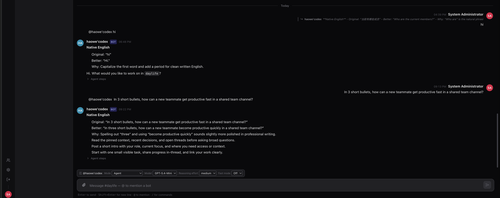

# Cheers

> **语言**：中文 | [English](README.md)

[](https://github.com/haowei2000/Cheers/actions/workflows/ci.yml)
[](https://github.com/haowei2000/Cheers/releases)
[](LICENSE)

🌐 **在线介绍页：** <https://haowei2000.github.io/Cheers/>

Cheers 是一个面向人类与 AI 智能体的 Slack 风格协作平台。它融合了实时频道聊天、可作为频道成员 `@` 提及的外部 ACP 智能体、支持文件的对话，以及持久化的频道历史与上下文。

<p align="center">
  
</p>
<p align="center"><sub>用户在共享频道里 <strong>@ 提及一个 AI 智能体</strong>——智能体在频道内直接回复，<strong>Viewboard</strong> 追踪每次交互，输入框提供逐条消息的模型与推理档位控制。</sub></p>

> 项目状态：早期公开预览。核心聊天、Bot 路由、Agent Bridge 连接与文件预览均可用；部署加固、权限边界与更广泛的智能体生态集成仍在演进中。

## 文档

英文是默认文档语言，中文镜像使用 `.zh-CN.md` 后缀。

**用户与运维文档**

- [文档主页](docs/help/README.zh-CN.md) / [English](docs/help/README.md)
- [**部署指南**（源码 · Docker Compose · Helm/K8s）](docs/help/deployment.zh-CN.md) / [English](docs/help/deployment.md)
- [使用说明书](docs/help/使用说明书.zh-CN.md) / [English](docs/help/使用说明书.md)
- [普通用户使用说明](docs/help/普通用户使用说明.zh-CN.md) / [English](docs/help/普通用户使用说明.md)
- [系统管理说明书](docs/help/系统管理说明书.zh-CN.md) / [English](docs/help/系统管理说明书.md)
- [Docker Compose 部署指南](docs/help/docker-compose-deploy.zh-CN.md) / [English](docs/help/docker-compose-deploy.md)
- [安装部署说明（旧版）](docs/help/安装部署说明.zh-CN.md) / [English](docs/help/安装部署说明.md)
- [技术排查 Q&A](docs/help/技术排查Q&A.zh-CN.md) / [English](docs/help/技术排查Q&A.md)
- [Agent Bridge 接入指南](docs/help/AgentBridge接入指南.zh-CN.md) / [English](docs/help/AgentBridge接入指南.md) —— 推荐使用 ACP 本地智能体；OpenClaw 链接为旧版/已弃用。
- [RustFS 对象存储部署说明](docs/help/RustFS对象存储部署说明.zh-CN.md) / [English](docs/help/RustFS对象存储部署说明.md)

**开发与架构文档**

- [路线图](docs/ROADMAP.zh-CN.md) / [English](docs/ROADMAP.md)
- [架构总览](docs/arch/ARCHITECTURE_OVERVIEW.md)
- [网格重构计划](docs/arch/REFACTOR_PLAN.md)
- [网关协议](docs/arch/WIRE_PROTOCOL.md)
- [Bot 权限与信任](docs/arch/BOT_PERMISSION.md)
- [网关架构](docs/arch/GATEWAY_CODE_ARCH.md)
- [ACP 连接与资源协议](docs/arch/ACP_CONNECTION_MODEL.md) / [docs/arch/AGENT_BRIDGE_RESOURCE.md](docs/arch/AGENT_BRIDGE_RESOURCE.md)
- [统一架构索引](docs/INDEX.zh-CN.md) / [English](docs/INDEX.md)

## 技术栈

- 后端：Rust 网关（Axum + SQLx）—— 唯一的后端服务
- 前端：React、TypeScript、Tailwind CSS、Vite
- 智能体：通过 `cheers-mcp-server` 与 ACP 连接器接入的外部 ACP 智能体（OpenCode、Claude、Codex）
- 存储：业务数据与频道历史用 PostgreSQL，文件用 S3 兼容对象存储
- 预览：内置于网关（`GET /files/:id/preview`）；office→PDF 转换由可选的 Gotenberg 完成
- 语音：可选的语音转文字（STT），通过 OpenAI 兼容（Whisper）端点转写音频，在管理员设置中运行时配置
- 部署：Docker Compose（单机）或通过 `deploy/helm/cheers` 的 Helm chart 部署到 Kubernetes

## 部署

Cheers 有三种运行方式 —— 三种方式详见[部署指南](docs/help/deployment.zh-CN.md)：

1. **源码运行** —— `cargo run` + `npm run dev`，依赖服务用 Docker（开发）。
2. **Docker Compose** —— 单机、全容器（自托管、演示）。见下方快速开始。
3. **Helm / Kubernetes** —— 集群工作负载（生产、横向扩展）；chart 位于 `deploy/helm/cheers`。

**最低硬件：** 核心栈约 2 核 / 4 GB 内存 / 10 GB 磁盘；含智能体 bot 约 4 核 / 8 GB 内存。
与 `docker-compose.yml.template` 和 `values-dev.yaml` 中设置的资源上限一致。

## 快速开始

```bash
cp docker-compose.yml.template docker-compose.yml
cp .env.example .env

# 首次启动前，至少修改 ADMIN_PASSWORD、POSTGRES_PASSWORD、
# STORAGE_S3_ACCESS_KEY、STORAGE_S3_SECRET_KEY，并生成 RS256 JWT 密钥对
# （JWT_PRIVATE_KEY / JWT_PUBLIC_KEY —— 见 .env.example 中的 openssl 命令）。
docker compose up -d
```

默认本地端点：

- 前端：http://localhost
- API：http://localhost:8000
- 健康检查：http://localhost:8000/health

文档预览（office→PDF）使用内置的 Gotenberg 服务，无需额外配置。切勿在生产环境使用 `.env.example` 中的密钥。

## 本地开发

```bash
cp docker-compose.yml.template docker-compose.yml
cp .env.example .env

# 启动前必须先编辑 .env，否则网关无法启动/无法登录：
# 生成 RS256 JWT 密钥对（JWT_PRIVATE_KEY / JWT_PUBLIC_KEY —— 见 .env.example
# 中的 openssl 命令），设置 ADMIN_PASSWORD 和各 change-me 密码；网关在宿主机
# 运行时需设置 STORAGE_S3_ENDPOINT=http://localhost:9000。
# 详见 docs/help/deployment.zh-CN.md（方式 1）。
docker compose up -d postgres redis rustfs gotenberg

# Rust 网关（启动时执行 sqlx 迁移）
cd server
cargo run
```

```bash
cd frontend
npm install
npm run dev
```

## Bots

平台是**外部智能体优先**的：没有内置 bot（旧的 `Coordinator` 已移除 —— 路由是确定性的
`@提及 → bot` 查找）。通过 `packages/cheers-mcp-server` 或 ACP 连接器接入一个外部 ACP
智能体（OpenCode、Claude、Codex），然后在频道中 `@` 它即可。参见
[docs/arch/BUILTIN_AGENT.md](docs/arch/BUILTIN_AGENT.md) 与
[docs/arch/DECENTRALIZED_MESH.md](docs/arch/DECENTRALIZED_MESH.md)。网关的默认种子数据
正在重建中。

## 贡献

提交 Pull Request 前请阅读 [CONTRIBUTING.md](docs/community/CONTRIBUTING.md)。

- 工作分支必须以 `develop` 为目标。
- `main` 只接受来自 `develop` 的合并。
- 提交前运行 `cd server && cargo build && cargo test` 以及前端构建。
- 安全问题请按 [SECURITY.md](docs/governance/SECURITY.md) 私下报告。

## 许可证

MIT。见 [LICENSE](LICENSE)。

Cheers 最初是从 AgentNexus（MIT）的 Rust 网关架构分支提取而来。原始版权声明保留在
[LICENSE](LICENSE) 中。
