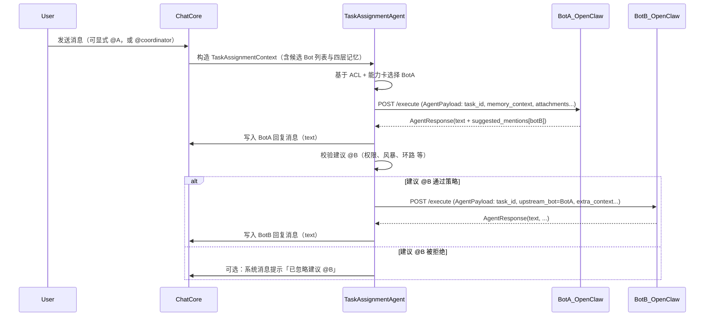

# AgentNexus 任务指派 Agent 与 OpenClaw 协作设计

> 版本：v1.0  
> 适用范围：AgentNexus 与基于 OpenClaw 的部门 Bot 协作场景  
> 关联文档：《AgentNexus 详细设计》《AgentNexus 门户与知识平台设计》《OpenClaw 接入指南》

---

## 1. 背景与目标

AgentNexus 作为协作中枢，负责 Workspace / Channel / User / BotAccount 等组织与协作模型，以及多 Bot 在频道中的协同。OpenClaw 作为 Agent 引擎，专注于单个（或一组）智能体内部的工具调用、任务拆解与推理流程。

本设计文档聚焦以下三件事：

1. **任务指派 Agent（Task Assignment Agent）的职责和设计**  
   说明 AgentNexus 中“选哪个 Bot 干这活”的上层逻辑，并刻意保持其足够“薄”，不侵入 OpenClaw 内部编排。
2. **OpenClaw 提交技能卡（Agent Card）的设计**  
   约定由 Bot 自主提供能力名片，AgentNexus 仅读取/缓存，避免在平台层复制第二套技能体系。
3. **OpenClaw 建议 @ 其他 Bot 时的规则与协调设计**  
   定义 A Bot → 建议 @B Bot 的结构化协议与安全约束，以及「用户 → A Bot → 建议 @B → B Bot」的完整时序。

整体原则：

- **平台层（AgentNexus）**：只做任务指派、权限与合规控制、任务观测与审计；不干预底层 Agent 引擎的内部工作流。  
- **引擎层（OpenClaw）**：负责单个 Bot 内部如何完成任务，包括多 Agent 协作、子任务拆解、工具调用与反思重试。  
- 使用统一的 `AgentPayload` / `AgentResponse` 协议串联两者，形成清晰的责任边界。

---

## 2. AgentNexus 任务指派 Agent 设计

### 2.1 职责边界

任务指派 Agent（Task Assignment Agent）是 AgentNexus 中一个非常“薄”的上层智能组件，其职责限定为三件事：

1. **接任务**  
   - 输入来源：  
     - 用户在某个 Channel 内发送的一条消息（可以显式 @ 某 Bot，也可以仅 @coordinator 或不 @）。  
     - 当前 Channel 的四层记忆：`ANCHOR / DECISIONS / FILES_INDEX / RECENT`。  
     - 当前 Channel 可用的 `BotAccount` 列表及其摘要能力信息（来自技能卡）。

2. **选 Bot（任务指派）**  
   - 职责：在“候选 Bot 集合”中，选择 0/1/多个 Bot 执行本次任务。  
   - 参考信息：  
     - Workspace / Channel 的白名单 / 黑名单、部门、租户、权限等硬约束（ACL）。  
     - Bot 的 `department` / `domains` / `skill_tags` / `summary` 等名片级能力信息。  
     - 可选：一个轻量的路由 Prompt（LLM）辅助决策。  
   - 输出：`selected_bots` 列表，每项包含 Bot 标识与简单决策理由。

3. **下发任务**  
   - 为每一个被选中的 Bot 构造标准化 `AgentPayload`：  
     - 包含：用户请求、四层记忆、附件 MD 内容、task_id / channel_id / 触发者信息等。  
   - 通过对应 Adapter（如 `http_openclaw`）调用 Bot 的 `execute` 接口。  
   - 接收 `AgentResponse`，将其中的用户可见内容写入 Channel 消息流，并记录任务日志。

**刻意不做的事：**

- 不拆分子任务；  
- 不设计 Tool 调用顺序；  
- 不介入 OpenClaw 内部的多 Agent 流程；  
- 不在任务指派 Agent 内维护任何“工具级”或“子技能级”逻辑。

任务指派 Agent 只回答一个问题：**“这活交给哪几个 Bot？”**；  
而不回答：**“这几个 Bot 内部要怎么干这活？”**。

---

### 2.2 TaskAssignmentContext：任务指派上下文（单线任务线程）

任务指派 Agent 的输入上下文（概念模型）如下：

```json
{
  "task_id": "uuid",
  "channel_id": "ch_xxx",
  "workspace_id": "ws_xxx",
  "trigger_message": {
    "message_id": "msg_xxx",
    "sender_id": "user_123",
    "sender_type": "user",
    "text": "@coordinator 帮我整理这次评审会议纪要，并拆成任务列表。",
    "created_at": "2026-03-12T10:00:00Z"
  },
  "memory_context": {
    "anchor": "（ANCHOR.md 内容）",
    "decisions": "（DECISIONS.md 内容）",
    "files_index": "（FILES_INDEX.md 内容）",
    "recent": "（RECENT.md 内容）"
  },
  "attachments": [
    {
      "file_id": "file_abc",
      "filename": "评审会议记录.docx",
      "md_content": "（转换后 MD 内容）"
    }
  ],
  "candidate_bots": [
    {
      "bot_id": "bot_qa",
      "username": "qa-bot",
      "display_name": "测试用例 Bot",
      "department": "QA",
      "skill_tags": ["测试用例", "需求分析"],
      "summary": "根据需求文档生成测试用例的 Bot。"
    }
    // ... 其他候选 Bot
  ]
}
```

说明：

- `candidate_bots` 由 AgentNexus 基于 Channel 配置与 ACL 预过滤产生，只包含“在当前场景下有资格被考虑的 Bot”。  
- Bot 的 `department` / `skill_tags` / `summary` 等字段来自技能卡（见第 3 章），是名片级能力信息。

---

### 2.3 TaskAssignmentResult：任务指派结果（不拆分子任务）

任务指派 Agent 的输出结果（概念模型）如下：

```json
{
  "task_id": "uuid",
  "selected_bots": [
    {
      "bot_id": "bot_qa",
      "reason": "用户意图为测试用例设计，匹配 QA 领域 Bot。"
    }
  ],
  "decision_log": "可选：简短说明或 LLM 生成的自然语言，用于审计与调试。"
}
```

AgentNexus 使用 `selected_bots` 去调用对应 Bot。  
`decision_log` 可用于：

- 在管理界面展示“为什么选了这个 Bot”；  
- 失败时协助排查路由问题。

---

### 2.4 实现策略与与现有模块关系

#### 2.4.1 实现策略（规则 + LLM 混合）

建议采用“规则 + LLM 混合”的路由策略：

1. **规则层（必有）**  
   - 基于 Channel / Workspace 的绑定关系、部门、租户、权限等信息构造 `candidate_bots`。  
   - 对显式 @ 的场景，若用户直接 @ 某 Bot，则优先选择该 Bot。

2. **LLM 层（可选）**  
   - 对于无显式 @ 或仅 @coordinator 的场景，将 `TaskAssignmentContext` 的摘要信息和 `candidate_bots` 的名片信息，交给一个轻量 LLM 进行 Bot 选择。  
   - 该 LLM 可以作为一个特殊的 OpenClaw Bot（routing-bot），也可以是 AgentNexus 内部的轻量推理组件。

#### 2.4.2 与现有模块关系

- 与 `ChatCore`：  
  - `ChatCore` 接收消息并解析显式 @ 列表；  
  - 将消息、Channel 信息、附件、显式 @ 结果传给任务指派 Agent。

- 与 `MemoryManager`：  
  - 任务指派 Agent 使用 `MemoryManager` 的读接口，获取四层记忆内容；  
  - 不直接写入记忆，仅将相关内容注入给后续 Bot。

- 与 `BotAccount` / `AgentOrchestrator`：  
  - `BotAccount` 存储技能卡摘要；  
  - 任务指派 Agent 从中构造 `candidate_bots`；  
  - 选中的 Bot 由 `AgentOrchestrator` + 各类 Adapter（如 `http_openclaw`）调用。

---

## 3. OpenClaw 技能卡（Agent Card）设计

### 3.1 设计目标

1. **单一真相**  
   - Bot 的能力描述（skills / 领域 / 职责）只在 Bot 自身（通常是 OpenClaw 服务）维护一份，AgentNexus 只是读取与展示。

2. **开放接入**  
   - 任何实现统一 Agent Card 规范的服务（不限于 OpenClaw）都可作为 Bot 被 AgentNexus 注册。

3. **平台只读**  
   - AgentNexus 不在内部重写或扩展技能配置，避免出现两套真相。

---

### 3.2 Agent Card JSON 规范（草案）

约定 Bot 提供 `GET /agent-card` 接口，返回类似结构：

```json
{
  "name": "qa-bot",
  "display_name": "测试用例 Bot",
  "version": "1.0.3",
  "description": "根据需求文档生成测试用例的 Bot。",

  "department": "QA",
  "owner": "qa-team@example.com",

  "domains": ["测试用例设计", "需求分析"],
  "skill_tags": ["qa", "test-cases", "requirements"],
  "intents": [
    "generate_test_cases_from_requirements",
    "review_requirement_coverage"
  ],

  "constraints": {
    "requires_human_approval": false,
    "sensitive_operations": []
  },

  "endpoints": {
    "execute": "/execute",
    "health_check": "/health"
  }
}
```

字段说明（关键部分）：

- `name` / `display_name`：技术名与人类可读名称。  
- `department`：部门或能力归属，如「QA」「Finance」「Ops」。  
- `domains` / `skill_tags` / `intents`：  
  - 用于给任务指派 Agent 和路由 LLM 提供“名片级能力信息”，而非工具级细节。  
- `constraints`：  
  - 声明该 Bot 是否默认需要人工确认、是否包含高风险操作（例如部署、删除资源）。  
- `endpoints.execute`：  
  - 标准 Agent 调用入口，接收 `AgentPayload` 并返回 `AgentResponse`。

---

### 3.3 Bot 注册流程

#### 3.3.1 Bot 侧准备

- Bot 服务（典型为 OpenClaw 部门 Bot）实现：  
  - `GET /agent-card`：返回上述 JSON；  
  - `POST /execute`：接收 `AgentPayload`，返回 `AgentResponse`；  
  - `GET /health`：健康检查。

#### 3.3.2 管理端在 AgentNexus 中创建 Bot

1. 管理员在前端「管理 → 创建 Bot」中填写：  
   - Bot 基础信息：名称、endpoint base URL 等。  
2. AgentNexus 调用 `<base_url>/agent-card`：  
   - 成功：展示卡片详情供管理员确认；  
   - 失败：提示配置错误或服务不可达。

3. 将 Agent Card 中部分字段写入 `BotAccount` 表：  
   - `username`（对应 `name`）、`display_name`、`department`、`skill_tags`、`summary/description` 等。  
   - 保留原始 `agent-card` 内容的只读缓存（JSON），用于调试与后续刷新。

#### 3.3.3 刷新与演进

- AgentNexus 提供“刷新技能卡”功能：  
  - 再次调用 `/agent-card`，更新本地缓存与摘要字段。  
  - 真正的能力调整（domains/intents/constraints 等）一律在 Bot（OpenClaw）仓库中维护。

---

## 4. OpenClaw 建议 @ 其他 Bot 与 AgentNexus 协调设计

### 4.1 背景与目标

需求：**允许某个 Bot（A Bot）在处理任务时，主动建议由其他 Bot（B Bot）接力继续工作**，例如：

- A Bot 负责整理需求，完成后建议 @qa-bot 继续生成测试用例；  
- 或 A Bot 初步分析告警后，建议 @ops-bot 进一步处理。

问题与风险：

- **权限**：A Bot 是否有权拉 B Bot？当前 Channel 是否允许 B Bot 存在？  
- **风暴 / 环路**：A ↔ B 不断互相拉对方，或 A→B→C→A 循环。  
- **用户可见性与责任追踪**：用户需要知道是谁发起了后续 Bot 调用，审计需要还原责任链路。

设计目标：

- 支持 Bot 之间的“主动建议协作”，最大化利用 OpenClaw 的自主编排能力；  
- 所有实际调用下一个 Bot 的决定仍由 AgentNexus 做出（包含权限与合规检查）；  
- 通过结构化协议与任务链路记录，实现可观测与可追责。

---

### 4.2 AgentPayload / AgentResponse 扩展

#### 4.2.1 AgentPayload（AgentNexus → OpenClaw Bot）

在已有结构基础上增加任务链路字段（概念模型）：

```json
{
  "task_id": "uuid",
  "channel_id": "ch_abc",
  "trigger_source": "user",          // user | bot
  "upstream_bot": null,             // 若本次调用由 Bot 建议触发，则为上游 Bot 名称，否则为 null

  "trigger_message": {
    "user": "张三",
    "text": "请帮我整理这次评审会议纪要，并拆成任务列表。",
    "timestamp": "2026-03-12T10:30:00Z"
  },

  "memory_context": {
    "anchor": "（ANCHOR.md）",
    "decisions": "（DECISIONS.md）",
    "files_index": "（FILES_INDEX.md）",
    "recent": "（RECENT.md）"
  },

  "attachments": [
    {
      "filename": "meeting.docx",
      "md_content": "（会议内容 MD）"
    }
  ],

  "process_config": {
    "mode": "sequential",
    "timeout_seconds": 120,
    "max_suggested_mentions": 3    // 提示 Bot：本次调用建议 @ 的数量上限
  }
}
```

说明：

- `task_id`：同一任务链路中所有 Bot 调用共用一个 task_id，便于审计与可视化。  
- `trigger_source`：指明任务链最初来源（user / bot）。  
- `upstream_bot`：若本次调用是由某 Bot 的建议触发，则记录该 Bot 名称。

#### 4.2.2 AgentResponse（OpenClaw Bot → AgentNexus）

在原有基础上增加 `suggested_mentions` 字段，用于结构化表达“建议 @ 其他 Bot”：

```json
{
  "text": "我已经根据会议记录整理出需求概览，建议由 @qa-bot 继续生成测试用例。",
  "metadata": {
    "tokens_used": 1234,
    "latency_ms": 3456
  },
  "suggested_mentions": [
    {
      "bot_name": "qa-bot",
      "hand_over_type": "continue_task",  // continue_task | sub_task
      "reason": "需要根据上述需求概览生成更细粒度的测试用例。",
      "extra_context": "请以当前需求概览为基础输出测试用例列表。"
    }
  ]
}
```

约束：

- `suggested_mentions` 仅代表**建议**，不保证一定会被执行；  
- AgentNexus 有权根据权限 / 策略 / 节流规则忽略或延后执行该建议；  
- 用户可通过 UI 看到“建议 @”的信息，并在必要时给予确认。

---

### 4.3 AgentNexus 对建议 @ 的协调规则

#### 4.3.1 权限与 ACL 校验

对每一条 `suggested_mentions[i]`，AgentNexus 必须做以下检查：

1. **Bot 存在性与启用状态**  
   - `bot_name` 能映射到现有 `BotAccount`；  
   - 该 Bot 处于启用状态。

2. **Channel / Workspace 级 ACL**  
   - 当前 Channel 是否允许该 Bot 加入和被 @；  
   - 若该 Bot 属于某一特定部门/租户，当前 Channel 是否具备相应权限。

3. **Bot 间权限矩阵（可选）**  
   - 配置上游 Bot（`upstream_bot`）是否有权建议目标 Bot；  
   - 防止某些低信任 Bot 随意拉高权限 Bot（如部署、财务）。

任何一项不满足 → 该建议直接被忽略（可记录在任务日志中，不提示给用户或以系统消息提示“已忽略建议 @X”）。

---

#### 4.3.2 风暴与环路控制

AgentNexus 为每个 `task_id` 维护一个简单的任务调用图与计数器：

- 节点：Bot 名称；  
- 边：一次实际的 Bot 调用（例如 `A → B`）。

控制策略示例：

1. **每个 Bot 在单个任务中的自动触发上限**  
   - 例如：同一个 `task_id` 中，某 Bot 通过建议被自动拉起超过 1 次，则后续需要人工确认。

2. **任务总自动跳转次数上限**  
   - 例如：一个 `task_id` 中，通过建议自动触发的 Bot 调用总数超过 3 次，则停止自动触发，提示用户手动决策。

3. **环路检测（简单版）**  
   - 若任务调用图中发现 `A→B→A` 或更长的循环且自动跳转次数已超过某阈值，则禁止继续自动建议触发，需人工干预。

这些策略可以在配置中调整，默认采用较保守的限额。

---

#### 4.3.3 人类确认（可选但推荐）

对高风险 Bot 或敏感操作，建议通过 Agent Card 或 AgentNexus 配置声明“需人工确认”：

- 例如在 Agent Card 中：  
  - `constraints.requires_human_approval = true`；  
  - 或在 `constraints.sensitive_operations` 中列出关键行为。

处理流程：

1. 当发现某建议 @ 涉及需要人工确认的 Bot / 操作时：  
   - AgentNexus 不直接发起对目标 Bot 的调用；  
   - 而是在 Channel 中插入一条系统消息或 UI 提示：

     > 「@analysis-bot 建议邀请 @deploy-bot 执行部署到生产环境，是否同意？」  
     > [同意] [拒绝]

2. 用户点击“同意”时：  
   - AgentNexus 再实际构造 `AgentPayload` 调用目标 Bot；  
   - 并在任务日志中记录“由某用户批准”。

3. 用户点击“拒绝”时：  
   - AgentNexus 记录拒绝原因；  
   - 可选：在 Channel 中提示“已拒绝建议 @deploy-bot”。

---

#### 4.3.4 触发 B Bot 调用

当某条建议 @B 通过规则与（可选）人工确认后，AgentNexus：

1. 构造新的 `AgentPayload` 发给 B Bot：  
   - `task_id`：沿用原任务 ID；  
   - `trigger_source`：仍可标记为 `user`（表示任务源于用户），但 `upstream_bot` 填写 A Bot 名称；  
   - `trigger_message`：可以为原始用户请求 + A Bot 输出的摘要；  
   - `memory_context`：保持与当前 Channel 一致；  
   - `attachments`：可附带 A Bot 的重要中间结果（例如生成的测试用例列表，以 MD 形式）。

2. 在 Channel 中插入消息，向用户解释任务流转：  
   - 例如：

     > 「系统：根据 @A-bot 的建议，已邀请 @B-bot 继续处理此任务。」  
     > 或直接呈现为 `@B-bot` 的回复消息前的一条提示。

3. 接收 B Bot 的 `AgentResponse`，将 `text` 写入消息流，并记录任务链路 `A → B`。

---

### 4.4 完整时序图：用户 → A Bot → 建议 @B → B Bot（单条任务线程）

下面以无人工确认的简单路径，展示一次完整协作流程；若启用人工确认，则在“建议 @B”与“调用 B Bot”之间插入用户交互即可。



若启用人工确认，则在 `taskAgent->>botB` 之前插入：

- `taskAgent->>chatCore`：插入“需要确认”的系统消息；  
- `user->>chatCore`：用户点击同意 / 拒绝；  
- `chatCore->>taskAgent`：回传确认结果；  
- `taskAgent` 再决定是否执行对 B Bot 的调用。

---

## 5. 小结

1. **任务指派 Agent**  
   - 只负责“选哪个 Bot 干这活”，通过 `TaskAssignmentContext` 和 `TaskAssignmentResult` 实现极薄上层编排；  
   - 不进入 OpenClaw 内部的工具流或多 Agent 协作逻辑。

2. **OpenClaw 技能卡**  
   - 每个 Bot 通过 `GET /agent-card` 提供能力名片，AgentNexus 在注册时只读接入，并缓存部分字段到 `BotAccount`；  
   - 能力定义与演进完全留在 Bot 自身仓库，平台不再维护第二份配置。

3. **建议 @ 其他 Bot 与协调**  
   - OpenClaw Bot 通过 `AgentResponse.suggested_mentions` 结构化表达“建议 @ 某 Bot”；  
   - AgentNexus 通过权限 / ACL / 风暴与环路控制 / 可选人工确认，决定是否真正触发该 Bot；  
   - 整个任务链路以 `task_id` 与 `upstream_bot` 组织，形成「用户 → A Bot → 建议 @B → B Bot」的清晰可观测路径。

