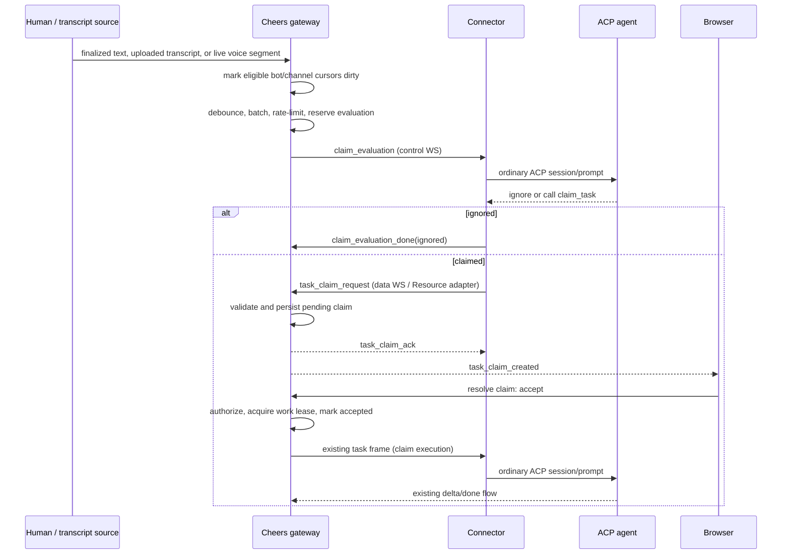

# Proactive channel monitoring and task claims

> Status: 📝 **Proposed design** (2026-07)
> Scope: text channels, uploaded-audio transcripts, and finalized real-time voice segments
> Related: [Agent Bridge Protocol](../arch/AGENT_BRIDGE_PROTOCOL.md) ·
> [Task Delivery](../arch/TASK_DELIVERY.md) ·
> [Bot Dispatch](BOT_DISPATCH.md) ·
> [Resource Context](RESOURCE_CONTEXT.md) ·
> [Real-time Voice Channels](REALTIME_VOICE_CHANNELS.md)

## The one-sentence pitch

Cheers can centrally observe channel activity, ask eligible bots whether a bounded batch
contains work within their declared scope, and let a bot submit a visible task claim for
human approval before the existing dispatcher starts an execution turn.

## 1. Problem

Today bot activation is deterministic: a channel message triggers a bot only when the bot
is explicitly `@`-mentioned. This is predictable, but it misses a common collaboration
pattern: people discuss work in a text or voice channel without knowing which bot should
handle the resulting task.

The proposed feature adds proactive participation without turning every message into an
agent run. A bot may monitor a channel, evaluate batched activity, and apply to take work
that matches its responsibility. The application is visible and auditable; evaluation is
not authorization to execute.

The system must solve five distinct problems:

1. detect new eligible text, uploaded-audio transcripts, or finalized live-voice segments;
2. control evaluation frequency and model cost;
3. let each bot judge relevance using its own capabilities and instructions;
4. prevent duplicate or competing execution;
5. preserve human control, channel permissions, and an audit trail.

## 2. Decisions

### 2.1 The gateway monitors; the bot judges

The Cheers gateway owns channel event observation, batching, scheduling, rate limits, and
delivery. A connector must not poll `read_messages` to discover work. Polling would make
offline recovery, cursor ownership, deduplication, and global rate limits inconsistent
across bot implementations.

The bot owns the semantic decision: whether the activity is relevant to its declared
scope, what task it believes exists, and what it proposes to do.

### 2.2 ACP remains unchanged

This feature does not require a new ACP method. The connector maps two Cheers Agent Bridge
commands to ordinary ACP prompts:

- **claim evaluation**: inspect a bounded activity batch and return no claim or create one;
- **approved execution**: execute an accepted claim through the existing task flow.

Channel subscriptions, claim persistence, and approval are Cheers platform concepts and
belong to Agent Bridge, Resource, REST, and browser protocols—not ACP JSON-RPC.

### 2.3 Evaluation and execution are separate turns

A claim-evaluation turn must not mutate channel resources, run shell commands, edit files,
or post a normal bot reply. Its only allowed terminal outcomes are:

- `ignored`: no task belongs to this bot;
- `claimed`: a pending task claim was created;
- `failed`: evaluation could not complete.

Only an accepted claim may enter the existing execution dispatcher. This separation is a
real authorization boundary, not merely a prompt instruction.

### 2.4 Claims use one domain service with multiple adapters

The canonical write path is a server-side `create_task_claim(...)` domain operation. The
Agent Bridge frame, Resource verb, and MCP tool are adapters to the same operation; none
implements independent validation or persistence.

MVP requires the Agent Bridge path because the gateway initiated the evaluation. The MCP
tool is recommended so an agent can submit a claim after inspecting additional context,
and so the capability remains composable with other agent workflows.

### 2.5 Human approval is the MVP default

A task claim starts as `pending`. An authorized human accepts or rejects it. Acceptance
dispatches the execution exactly once. Auto-accept policies are deferred until the claim
quality, false-positive rate, and governance model are measured in production.

For the MVP, channel `owner` and `admin` roles may resolve claims. Expanding approval to
all channel members can be added later as an explicit channel policy.

### 2.6 Bots consume final transcript segments, never the room audio stream

Uploaded audio remains eligible only after the existing opt-in transcription worker reaches
`done`. Real-time voice channels follow the separate
[Real-time Voice Channels](REALTIME_VOICE_CHANNELS.md) design: an SFU carries media, an
authorized room transcriber produces speaker-attributed interim/final segments, and only
final segments enter the durable `channel_seq` activity stream.

Bot claim evaluation consumes Resource references to those final segments. It never opens a
raw microphone track, receives continuous PCM through Agent Bridge, or treats interim
captions as stable input. This keeps the claim path replayable and makes consent, retention,
and speaker attribution platform-governed.

## 3. User experience

### 3.1 Bot monitoring configuration

An owner or admin configures a bot within a channel:

```jsonc
{
  "mode": "off" | "text" | "text_and_transcript" | "all_activity",
  "scope": "Own frontend accessibility and React UI implementation tasks.",
  "debounce_seconds": 15,
  "min_interval_seconds": 60,
  "max_evaluations_per_hour": 20,
  "batch_size": 8,
  "confidence_threshold": 0.75,
  "immediate_triggers": ["urgent", "accessibility"],
  "quiet_hours": { "start": "22:00", "end": "08:00", "timezone": "Asia/Taipei" }
}
```

`text_and_transcript` includes uploaded-audio transcripts; `all_activity` additionally
includes final real-time voice segments. `mode` defaults to `off`. `scope` is required before
monitoring can be enabled. Limits are server-clamped so a client cannot configure an
unbounded evaluator.

### 3.2 Claim card

A pending claim appears in the channel near the source activity and includes:

- bot identity;
- task summary;
- proposed actions;
- source message range;
- confidence and optional impact estimate;
- `Accept` and `Reject` actions;
- expiry time and current status.

The card is not a chat reply and does not increment a bot-to-bot reply chain. Accepting it
creates a normal bot execution placeholder through the existing dispatcher, linked back to
the claim.

### 3.3 Competing claims

Multiple bots may claim the same source batch. The first accepted claim acquires the work
lease. By default, other pending claims for the same work item become `superseded`. An
approver may explicitly choose `allow_multiple=true` when parallel work is intentional;
this is deferred from the first UI but retained as a domain option.

## 4. End-to-end flow



## 5. Frequency control and scheduling

“Listening frequency” is enforced by the gateway at four layers:

1. **Debounce**: activity arriving within `debounce_seconds` is combined.
2. **Minimum interval**: one bot/channel pair cannot begin another evaluation before
   `min_interval_seconds` elapses.
3. **Hourly budget**: a rolling `max_evaluations_per_hour` cap bounds model calls.
4. **Batch bound**: at most `batch_size` finalized events enter one evaluation.

These controls operate per `(channel_id, bot_id)`. Voice adds a silence debounce and maximum
conversation-batch duration before this general limiter (see the real-time voice design),
so ordinary pauses group speech into turns without waiting for the full text debounce. A
separate deployment-wide limiter protects the gateway and connectors from a busy workspace
causing fleet-wide fan-out.

### 5.1 Cursor model

Each enabled bot/channel pair stores:

- `last_observed_seq`: highest finalized activity seen by the scheduler;
- `last_evaluated_seq`: highest activity included in a completed or durably reserved
  evaluation;
- `next_eligible_at`: result of debounce, minimum interval, and quiet-hours policy;
- rolling evaluation counters.

The scheduler reads finalized channel activity by `channel_seq`; it never relies on wall
clock ordering. A durable evaluation reservation records an inclusive sequence range.
After a crash, the same reservation can be redelivered with the same idempotency key.

### 5.2 Immediate triggers

An immediate trigger may bypass debounce and quiet hours, but never bypasses:

- channel membership and monitoring mode;
- deployment-wide safety limits;
- evaluation idempotency;
- claim validation and human approval.

An explicit `@mention` continues through the current direct-execution route and is not
converted into a claim evaluation. This preserves existing user expectations.

### 5.3 Backpressure

When a bot is offline or busy, the scheduler retains the cursor and delays evaluation; it
does not create an empty chat placeholder. If unprocessed activity exceeds the configured
look-back window, the next prompt receives a bounded summary plus the exact sequence range,
and the audit row records that older details were compacted.

## 6. Data model

Implementation must add new, sequential sqlx migrations using the next prefix available
after rebasing. Already-applied migrations must not be edited.

### 6.1 `channel_bot_monitoring`

One row per channel/bot membership:

| Column | Type | Notes |
|---|---|---|
| `channel_id` | `VARCHAR(36)` | part of primary key |
| `bot_id` | `VARCHAR(36)` | part of primary key |
| `mode` | `VARCHAR(32)` | `off`, `text`, `text_and_transcript`, `all_activity` |
| `scope` | `TEXT` | bot responsibility used in evaluation |
| `policy` | `JSONB` | bounded timing and trigger options |
| `last_observed_seq` | `BIGINT` | durable scheduler cursor |
| `last_evaluated_seq` | `BIGINT` | durable completed/reserved cursor |
| `next_eligible_at` | `TIMESTAMPTZ` | scheduler wake time |
| `created_at` / `updated_at` | `TIMESTAMPTZ` | audit metadata |

The membership row remains the source of truth for whether a bot belongs to a channel.
Removing the membership disables and removes its monitoring configuration transactionally.

### 6.2 `task_claim_evaluations`

Durable evaluation reservation and outcome:

| Column | Type | Notes |
|---|---|---|
| `evaluation_id` | `VARCHAR(36)` | primary key |
| `channel_id` / `bot_id` | `VARCHAR(36)` | evaluator identity |
| `min_seq` / `max_seq` | `BIGINT` | inclusive source range |
| `status` | `VARCHAR(24)` | `reserved`, `running`, `ignored`, `claimed`, `failed`, `expired` |
| `attempts` | `INTEGER` | bounded redelivery count |
| `lease_until` | `TIMESTAMPTZ` | crash recovery |
| `reason_code` | `VARCHAR(64)` | structured terminal reason |
| `created_at` / `finished_at` | `TIMESTAMPTZ` | timing |

A unique constraint on `(channel_id, bot_id, min_seq, max_seq)` prevents duplicate model
evaluation for the same reservation.

### 6.3 `task_claim_requests`

The user-visible claim—not the historical delivery claim table described by old task
delivery documents:

| Column | Type | Notes |
|---|---|---|
| `claim_id` | `VARCHAR(36)` | primary key |
| `evaluation_id` | `VARCHAR(36)` | source evaluation |
| `channel_id` / `bot_id` | `VARCHAR(36)` | claimant |
| `min_seq` / `max_seq` | `BIGINT` | source activity |
| `summary` | `TEXT` | normalized task statement |
| `proposed_actions` | `JSONB` | bounded string array |
| `confidence` | `NUMERIC(4,3)` | `0.000`–`1.000` |
| `estimated_impact` | `VARCHAR(32)` | optional `read_only`, `workspace_write`, `external_effect`, `unknown` |
| `status` | `VARCHAR(24)` | `pending`, `accepted`, `rejected`, `expired`, `superseded`, `cancelled` |
| `resolved_by` | `VARCHAR(36)` | human user id |
| `resolution_reason` | `TEXT` | optional |
| `execution_msg_id` | `VARCHAR(36)` | placeholder after acceptance |
| `expires_at` | `TIMESTAMPTZ` | pending lease |
| timestamps | `TIMESTAMPTZ` | creation and resolution |

A partial unique index permits at most one active claim per `(evaluation_id, bot_id)`. Claim
resolution uses a transaction and row lock so two approvers cannot dispatch twice.

## 7. Protocol and API contracts

### 7.1 Agent Bridge: gateway to connector

`claim_evaluation` is a control command, parallel to `task` but without creating a partial
chat message:

```jsonc
{
  "type": "claim_evaluation",
  "v": 1,
  "evaluation_id": "<uuid>",
  "channel_id": "<uuid>",
  "min_seq": 120,
  "max_seq": 127,
  "scope": "Own frontend accessibility and React UI implementation tasks.",
  "confidence_threshold": 0.75,
  "context": [
    {
      "verb": "channel.messages.by-seq",
      "params": { "channel_id": "<uuid>", "min_seq": 120, "max_seq": 127 }
    }
  ],
  "lease_until": "<RFC3339>"
}
```

The context is reference-only and resolved under the receiving bot’s permissions, matching
the Resource Context governance model.

### 7.2 Agent Bridge: connector to gateway

Ignoring the batch is an explicit, low-cost terminal frame:

```jsonc
{
  "type": "claim_evaluation_done",
  "v": 1,
  "evaluation_id": "<uuid>",
  "outcome": "ignored",
  "reason_code": "outside_scope"
}
```

A claim request is sent on the data stream:

```jsonc
{
  "type": "task_claim_request",
  "v": 1,
  "client_msg_id": "<uuid>",
  "evaluation_id": "<uuid>",
  "channel_id": "<uuid>",
  "source": { "min_seq": 120, "max_seq": 127 },
  "summary": "Audit and fix the accessibility of the new settings form.",
  "proposed_actions": ["Inspect the form", "Implement fixes", "Run frontend tests"],
  "confidence": 0.91,
  "estimated_impact": "workspace_write"
}
```

The gateway replies with `task_claim_ack`, correlated by `client_msg_id`, containing either
`claim_id` and `status` or a structured error. Retries with the same `client_msg_id` are
idempotent.

### 7.3 Resource verbs

The canonical platform operations are:

| Verb | Principal | Purpose |
|---|---|---|
| `channel.task_claims.create` | bot | create a claim for its own valid evaluation |
| `channel.task_claims.list` | member | list visible claims in a channel |
| `channel.task_claims.resolve` | authorized human | accept or reject a pending claim |
| `channel.task_claims.cancel` | claimant bot or channel admin | cancel a pending claim |

`create` requires an `evaluation_id`; the MVP does not permit unsolicited claims against an
arbitrary message. This keeps the scheduler and rate-limit boundary enforceable.

### 7.4 MCP tools

`packages/cheers-mcp-server` exposes thin mappings:

```text
claim_task       -> channel.task_claims.create
list_task_claims -> channel.task_claims.list
cancel_task_claim -> channel.task_claims.cancel
```

Human resolution is intentionally not exposed as a bot MCP tool. Bots cannot approve their
own claims. The browser uses REST endpoints backed by the same domain service:

```text
GET  /api/v1/channels/:channel_id/task-claims
POST /api/v1/channels/:channel_id/task-claims/:claim_id/resolve
PUT  /api/v1/channels/:channel_id/bots/:bot_id/monitoring
GET  /api/v1/channels/:channel_id/bots/:bot_id/monitoring
```

### 7.5 Accepted execution task

Acceptance reuses `gateway::dispatcher::dispatch`. The task frame gains attribution fields
without changing ACP:

```jsonc
{
  "trigger": "accepted_task_claim",
  "claim_id": "<uuid>",
  "evaluation_id": "<uuid>",
  "source_min_seq": 120,
  "source_max_seq": 127
}
```

The dispatcher’s existing deterministic placeholder id must use a claim-specific trigger
identity so it does not collide with direct `@mention` execution. Claim acceptance and
placeholder creation must form one idempotent application operation; a compatibility
placeholder or hard-coded alternate branch is not acceptable.

## 8. Authorization and safety

### 8.1 Evaluation eligibility

Before reserving an evaluation, the gateway verifies:

- the bot is an active member of the channel;
- monitoring is enabled and the activity type matches its mode;
- the bot connector is ready and supports claim evaluation;
- the source contains at least one human-authored message, completed uploaded transcript,
  or finalized live-voice segment;
- the source is not solely the bot’s own output, claim cards, traces, or permission cards;
- frequency and deployment-wide limits allow another evaluation.

### 8.2 Claim creation

The server, never the connector, clamps text lengths, action count, confidence range, expiry,
and source range. It verifies that the evaluation belongs to the authenticated bot and that
the source range exactly matches the reservation. A bot cannot claim on behalf of another
bot or widen the observed range.

### 8.3 Approval

Acceptance requires current channel role authorization at resolution time. Membership and
role may have changed since claim creation. If policy evaluation or the transaction fails,
acceptance fails closed and no execution task is dispatched.

Approving a claim authorizes the proposed task to begin; it does not approve every later
tool action. Existing ACP permission requests and bot permission policy continue to govern
execution-time effects.

### 8.4 Privacy

Monitoring does not grant new visibility. Activity references are resolved as the bot under
the existing Resource permission model. Disabled monitoring stops new evaluations but does
not delete existing claim audit records. Audio is not transcribed merely because a bot has
`text_and_transcript` or `all_activity` mode. Voice transcription is a separate, visible
channel/session policy with its own consent and retention boundary.

## 9. Failure handling

| Failure | Required behavior |
|---|---|
| Connector offline before reservation | delay; do not create evaluation or chat card |
| Disconnect after reservation | lease expires; bounded redelivery with same evaluation id |
| Agent returns malformed claim | reject with structured ack; mark attempt failed |
| Agent times out | mark evaluation `failed` or retry within attempt limit |
| Duplicate claim frame | return the original `claim_id` via idempotency key |
| Two humans accept | one transaction wins; the other receives final current status |
| Bot removed from channel | disable monitoring; reject pending claims; block acceptance |
| Bot offline at acceptance | keep claim accepted with bounded dispatch lease, or fail visibly; never show an endless partial placeholder |
| Gateway restart | resume durable reservations and expire stale pending claims |

## 10. Observability and audit

Every evaluation records duration, outcome, source range, delivery attempts, and reason code.
Every claim state transition records actor, previous/new status, timestamp, and reason.
Metrics should include:

- evaluation count, latency, failure rate, and estimated token usage;
- ignored/claimed ratio per bot and channel;
- claim acceptance, rejection, expiry, and supersession rates;
- time from source activity to claim and from acceptance to execution;
- duplicate suppression and rate-limit counts.

The primary quality signal is accepted claims per evaluation. A high claim rate with a low
acceptance rate indicates scope or prompt problems; increasing evaluation frequency would
make the problem worse.

## 11. Rollout plan

### Phase C1 — domain and protocol

- add migrations and domain services for monitoring, evaluations, and claims;
- add scheduler with durable cursors, leases, debounce, and limits;
- add Agent Bridge frames and Rust connector support;
- add claim Resource verbs and MCP mappings;
- keep the feature behind a server capability flag and monitoring default `off`.

Outcome: a test connector can evaluate a text batch, create one pending claim, and ignore a
batch without posting chat output.

### Phase C2 — approval and execution

- add REST resolution endpoints and realtime browser frames;
- render claim cards and monitoring settings;
- connect accepted claims to the existing dispatcher with end-to-end idempotency;
- add audit views and expiry sweeper.

Outcome: an owner/admin can accept exactly one claim and observe a normal streamed bot turn.

### Phase C3 — transcript activity sources

- mark transcript completion as eligible activity;
- include transcript Resource references in evaluation batches;
- consume finalized real-time voice segments after Voice V2 ships;
- add transcript-specific privacy text, speaker/source attribution, and audit fields.

Outcome: explicitly transcribed uploads and live voice can produce task claims without
exposing raw audio to bots.

### Deferred

- mixed-microphone diarization (normal SFU microphone tracks use authenticated track owner);
- auto-accept by risk tier or trusted bot;
- unsolicited bot claims without a scheduler reservation;
- multi-bot parallel acceptance UI;
- semantic pre-filtering or a central classifier before bot evaluation.

## 12. Verification

### Unit and domain tests

- debounce, minimum interval, hourly cap, quiet hours, and immediate-trigger precedence;
- sequence cursor advancement and crash-safe reservation replay;
- one active claim per bot/evaluation and `client_msg_id` idempotency;
- claim payload validation and source-range ownership;
- role check at resolution time;
- concurrent acceptance dispatches once;
- bot removal disables monitoring and blocks pending claims;
- claim evaluation cannot use execution-only effects.

### Integration tests

- text activity → one batched evaluation → ignored;
- text activity → pending claim → accept → streamed execution result;
- two bots claim the same work → one accepted, other superseded;
- connector disconnect/reconnect redelivers the same evaluation without duplicate claim;
- completed uploads and finalized live segments are eligible while pending/interim/raw audio
  is not;
- explicit `@mention` still follows direct execution and bypasses the claim path;
- disabled monitoring produces no evaluation.

### Required package checks

Connector changes must follow the repository’s Rust connector release order. At minimum:

```bash
cd packages/cheers-acp-connector-rs
cargo fmt --check
cargo test
cargo check

cd ../../server
cargo build
cargo test
```

Database behavior must also be verified from an empty Postgres database using the complete
linear sqlx migration chain.

## 13. Non-goals

- replacing explicit `@mention` routing;
- allowing a claim evaluation to execute tools or modify resources;
- changing ACP itself;
- letting connectors independently poll channel history;
- silently auto-transcribing uploaded audio or voice rooms;
- treating a claim approval as blanket approval for later tool permissions;
- reusing the existing ACP permission card as a task claim card—the lifecycles, actors, and
  approval semantics are different.

## 14. Open questions

1. Should accepted claims queue while a bot is offline, or fail immediately and return to
   `pending`? The recommended first behavior is a short durable dispatch lease followed by a
   visible failure, not an indefinite queue.
2. Should ordinary channel members eventually be allowed to resolve claims, or should this
   remain owner/admin-only per channel?
3. What server-wide defaults and hard maximums should apply to evaluation frequency and
   hourly budgets?
4. Should a future low-cost central classifier pre-filter candidate bots, or is each bot’s
   self-evaluation accurate and affordable enough?
