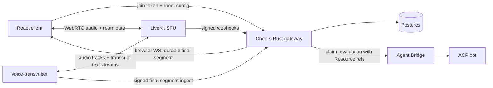
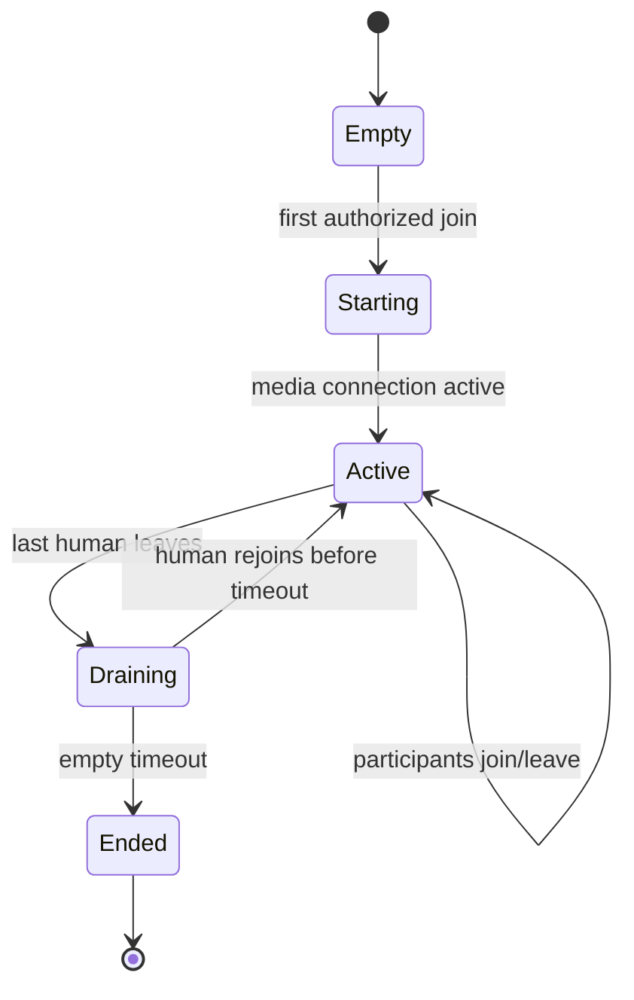

# Real-time voice channels

> Status: 🚧 **Voice V1 + final-transcript contract implemented; streaming worker and task claims proposed** (2026-07)
> Product goal: Discord-style persistent voice channels with live, speaker-attributed
> transcription as a first-class collaboration stream
> Related: [Proactive task claims](PROACTIVE_TASK_CLAIMS.md) ·
> [Conversation model](../arch/CONVERSATION_MODEL.md) ·
> [Message pagination](../arch/MESSAGE_PAGINATION.md)

## The one-sentence pitch

A Cheers voice channel is a persistent place people can enter and leave freely, backed by
a WebRTC SFU for low-latency audio and a consent-aware transcription worker that turns
final speech segments into durable channel activity, allowing bots to notice and claim work
without receiving raw room audio.

## 1. Why voice is part of the task-claim foundation

Task claiming is most valuable when work emerges from conversation rather than from a
carefully written request. In text, a participant can still edit a message or `@` a bot. In
multi-party voice collaboration, decisions and action items appear quickly, overlap with
other discussion, and are easy to lose. A bot that can identify “this is my work” and raise
a visible claim turns a voice room from ephemeral talk into an operational workspace.

This makes live voice a product primitive, not an attachment enhancement. The existing
audio-file pipeline remains useful for voice notes and recordings, but it cannot provide
room presence, low-latency conversation, speaker identity, or stable transcript segments
during a meeting.

## 2. Current state and gap

Voice V1 now provides:

- persistent `text` and `voice` channel kinds;
- membership-authorized, short-lived, room-scoped LiveKit join tokens;
- browser join/leave, microphone mute, remote audio, participant count, and active-speaker UI;
- idempotent signed LiveKit webhook ingestion for room, participant, and microphone lifecycle state;
- app-wide voice occupancy snapshots and live sidebar participant presence;
- authenticated, idempotent final-transcript ingestion with speaker/track validation;
- durable final captions, transcript REST/Resource reads, and unified channel activity sequencing;
- a dedicated small-VM Docker Compose stack for LiveKit, Redis, and Caddy.

The earlier attachment flow still supports:

- audio files and voice-note attachments in chat;
- an inline browser audio player;
- user-requested, asynchronous transcription through an OpenAI-compatible STT endpoint;
- transcript-first delivery to ACP agents, with native audio blocks as a capability-gated
  fallback.

Cheers still does not have the transcription worker, durable live transcript event model,
moderation controls, or proactive task-claim scheduler.
The existing `transcription_worker` polls S3-backed files and may take minutes; it must not
be stretched into a real-time media service.

## 3. Decisions

### 3.1 Use an SFU; do not route media through the Rust gateway

The gateway remains the control plane: identity, authorization, channel membership, token
issuance, webhook verification, transcript persistence, audit, and task-claim scheduling.
The SFU is the media plane: WebRTC signaling, NAT traversal, RTP routing, active-speaker
signals, and audio quality adaptation.

The recommended first implementation uses **LiveKit** behind an internal `VoiceProvider`
interface. LiveKit is an open-source WebRTC SFU with web/mobile SDKs, self-hosting and cloud
options, webhooks, participant/track events, and text streams for real-time transcription.
This is a replaceable infrastructure choice, not a LiveKit-shaped Cheers domain model.

References:

- [LiveKit architecture and SFU overview](https://docs.livekit.io/intro/about/)
- [Self-hosting overview](https://docs.livekit.io/transport/self-hosting/)
- [Webhooks and room events](https://docs.livekit.io/intro/basics/rooms-participants-tracks/webhooks-events/)
- [Text and transcription streams](https://docs.livekit.io/agents/multimodality/text/)

Peer-to-peer mesh is rejected. Upload bandwidth and connection count grow with room size,
TURN fallback becomes difficult to operate, server-side transcription has no reliable media
subscription point, and moderation cannot be enforced consistently.

### 3.2 Separate channel access type from interaction kind

The existing `channels.type` means access/conversation semantics (`public`, `private`,
`dm`). Adding `voice` to that enum would incorrectly make “voice” mutually exclusive with
“private”. Add a new dimension instead:

```text
channels.type: public | private | dm       # existing access/conversation semantics
channels.kind: text | voice                # new interaction kind
```

A `kind='voice'` channel still owns a durable text timeline for system notices, transcript
history, task claims, files, and bot results. A voice channel is persistent even when its
media room has no participants, matching the Discord mental model.

DM voice calls and mixed text/voice channels can be added later without changing this
separation. The MVP permits `kind='voice'` only for `public` and `private` channels.

### 3.3 Audio and transcript take different paths

Raw audio flows only through the media plane and the authorized transcription worker. Bots
receive finalized transcript references through Cheers Resource context. They do not join
the room, subscribe to every microphone, or receive continuous PCM through Agent Bridge.

This choice keeps ACP text-first and provider-neutral, limits raw-audio exposure, makes bot
evaluation replayable, and allows the task-claim scheduler to use the same durable
`channel_seq` clock as text collaboration.

Future conversational voice bots may join rooms as visible participants and publish audio,
but that is separate from silent task-claim monitoring.

### 3.4 One transcription participant per active room

When transcription is enabled and at least one human is publishing audio, a separate
`voice-transcriber` service joins the room as a hidden service participant. It subscribes
to human audio tracks, performs VAD/turn segmentation and streaming STT, and publishes
interim/final text streams for live UI.

Only final segments are sent to the Cheers gateway for durable persistence and bot task
evaluation. Interim segments are replaceable presentation state and must not consume
`channel_seq`, trigger claims, notifications, or audit rows.

The transcriber is media infrastructure, not a second application backend. The Rust gateway
remains the only owner of Cheers domain data. A first implementation may use a separately
deployed LiveKit Agents worker because it can subscribe to raw tracks and publish standard
transcription text streams; the integration boundary is the provider-neutral transcript
ingest contract in this document.

### 3.5 Transcription is explicit, visible, and policy-controlled

A voice channel has one of three transcription policies:

```text
off        # no server-side audio subscriber, no transcript
on_demand  # an authorized member starts/stops transcription for the current session
always_on  # transcription starts when the first human joins
```

The default is `on_demand`. `always_on` requires an owner/admin decision and a workspace
policy that permits it. Every participant sees a persistent transcription indicator before
their microphone is published. Joining does not imply recording consent where local policy
requires an explicit acknowledgement.

Recording and transcription are separate controls. Transcription does not imply room audio
recording, and the MVP does not record raw audio.

## 4. Architecture



### 4.1 Control plane responsibilities

Cheers gateway:

- validates channel membership and voice permissions;
- issues short-lived, least-privilege SFU join tokens;
- maps Cheers identities to opaque media identities;
- stores channel voice policy and session state;
- verifies and deduplicates SFU webhooks;
- accepts authenticated final transcript segments;
- allocates `channel_seq` transactionally;
- fans durable state to browsers;
- feeds final transcript activity to proactive task claiming;
- owns retention, deletion, export, and audit policy.

### 4.2 Media plane responsibilities

SFU/provider:

- WebRTC signaling and secure media transport;
- ICE and TURN/NAT traversal;
- selective forwarding of audio tracks;
- mute state, active speaker, and connection quality;
- participant and track lifecycle events;
- short-lived room data/text streams.

The SFU database, if any, is not a Cheers source of truth. Provider state is reconciled into
Cheers sessions through idempotent webhooks and explicit room queries.

### 4.3 Transcription worker responsibilities

The worker:

- joins only rooms authorized for transcription;
- subscribes only to human microphone tracks;
- keeps source track and participant identity attached to every segment;
- sends interim text to the room for low-latency captions;
- sends final segments to the gateway with stable idempotency keys;
- never writes directly to Postgres;
- stops promptly when the policy changes, the session ends, or consent is withdrawn.

## 5. Identity and authorization

### 5.1 Media identities

Never put emails, usernames, or bearer tokens in the SFU participant identity. The gateway
mints an opaque identity scoped to one voice session:

```text
cheers:<voice_session_id>:<user_id>:<connection_nonce>
```

Display name and avatar are non-authoritative participant metadata. On every webhook or
transcript ingest, the gateway resolves the opaque identity against its issued-token record
and current channel membership.

### 5.2 Join tokens

`POST /api/v1/channels/:channel_id/voice/join` returns a short-lived provider token and room
configuration. A human token may publish one microphone track and subscribe to room audio.
It cannot create rooms, update other participants, publish data as the transcription
service, or access another channel.

The transcriber receives a service token that may subscribe to audio and publish transcript
text but cannot publish a microphone/camera track or administer the room.

### 5.3 Channel roles

Initial policy:

| Operation | Minimum authorization |
|---|---|
| View voice channel | existing channel visibility/membership rules |
| Join/listen/speak | active channel member; `readonly` may listen but not publish |
| Mute self | participant |
| Mute/remove another participant | channel owner/admin |
| Start `on_demand` transcription | channel owner/admin in MVP |
| Stop transcription | starter or channel owner/admin |
| Configure `always_on` | channel owner/admin + workspace policy |
| Read final transcript | same Resource authorization as channel activity |

Provider permissions are defense in depth; the gateway checks authorization before issuing
or changing tokens and again when persisting domain events.

## 6. Room and session lifecycle

A voice channel is durable. A `voice_session` represents one occupancy interval, beginning
when the first human joins and ending after the last human leaves plus a short empty timeout.



The gateway creates or reuses the provider room when issuing the first token. Webhooks are
advisory inputs; `participant_joined` means the media connection is active, while a signal
connection alone is insufficient. Presence in the normal Cheers browser WebSocket is not
voice presence.

After gateway restart, active provider rooms are reconciled into non-ended voice sessions.
Duplicate and out-of-order webhooks are handled by provider event id and monotonic local
state transitions.

## 7. Real-time transcription contract

### 7.1 Interim stream

The transcriber publishes interim and final text to the SFU text-stream topic
`lk.transcription` when using LiveKit. Clients replace interim content by `segment_id`; they
do not append every revision. The provider adapter converts this to a UI-neutral shape:

```jsonc
{
  "segment_id": "provider-stable-id",
  "participant_identity": "opaque-media-identity",
  "track_id": "audio-track-id",
  "text": "we should have the frontend bot...",
  "is_final": false,
  "started_at_ms": 174000,
  "ended_at_ms": 176800,
  "language": "zh",
  "revision": 3
}
```

Interim text is best effort. It may be lost on reconnect and is not shown in historical
transcripts.

### 7.2 Final ingest

The transcriber posts final segments over an authenticated internal endpoint:

```text
POST /internal/v1/voice/sessions/:voice_session_id/transcript-segments
```

```jsonc
{
  "provider_event_id": "<idempotency-key>",
  "segment_id": "provider-stable-id",
  "participant_identity": "opaque-media-identity",
  "track_id": "audio-track-id",
  "text": "We should have the frontend bot audit the settings form.",
  "started_at_ms": 174000,
  "ended_at_ms": 178300,
  "language": "en",
  "confidence": 0.93,
  "finalized_at": "<RFC3339>"
}
```

The gateway validates session state, issued identity, channel membership at speech time,
text size, timestamps, and idempotency. It then inserts the final segment and allocates one
`channel_seq` in the same transaction. Only after commit does it fan out
`voice_transcript_final` to browser subscribers and mark task-claim schedulers dirty.

### 7.3 Segment stability

Final normally means immutable. When a provider produces a justified final correction, it
must create a new revision referencing `supersedes_segment_id`; it never overwrites text in
place. The task-claim evaluator consumes the latest visible revision and receives both ids
so audit remains reproducible.

### 7.4 Speaker attribution

Each microphone is a separate SFU track, so speaker attribution comes from authenticated
track ownership rather than acoustic diarization. Diarization is only needed for mixed
external ingress or shared-room microphones and is deferred.

## 8. Data model

Implementation must add new, sequential sqlx migrations using the next prefix after
rebasing. IDs remain `VARCHAR(36)` to match the baseline.

### 8.1 Channel columns

```text
channels.kind                  VARCHAR(16) NOT NULL DEFAULT 'text'
channels.voice_config          JSONB       NOT NULL DEFAULT '{}'
```

`voice_config` contains bounded provider-neutral settings: transcription policy, consent
mode, empty timeout, participant cap, and retention days. Provider URL and credentials are
system settings, never channel JSON.

### 8.2 `voice_sessions`

| Column | Type | Notes |
|---|---|---|
| `voice_session_id` | `VARCHAR(36)` | primary key |
| `channel_id` | `VARCHAR(36)` | voice channel |
| `provider` | `VARCHAR(32)` | e.g. `livekit` |
| `provider_room_id` | `VARCHAR(255)` | opaque provider ref |
| `status` | `VARCHAR(24)` | `starting`, `active`, `draining`, `ended`, `failed` |
| `transcription_status` | `VARCHAR(24)` | `off`, `starting`, `active`, `stopping`, `failed` |
| `transcription_started_by` | `VARCHAR(36)` | nullable user id |
| `started_at` / `ended_at` | `TIMESTAMPTZ` | occupancy interval |
| `empty_deadline_at` | `TIMESTAMPTZ` | drain lease |

Only one non-ended session may exist per channel.

### 8.3 `voice_participant_sessions`

| Column | Type | Notes |
|---|---|---|
| `participant_session_id` | `VARCHAR(36)` | primary key |
| `voice_session_id` | `VARCHAR(36)` | owning session |
| `user_id` | `VARCHAR(36)` | authenticated Cheers user |
| `provider_identity` | `VARCHAR(255)` | unique opaque identity |
| `connection_nonce` | `VARCHAR(36)` | distinguishes tabs/devices |
| `joined_at` / `left_at` | `TIMESTAMPTZ` | media-active interval |
| `mic_published_at` | `TIMESTAMPTZ` | nullable |
| `consent_version` | `VARCHAR(32)` | accepted disclosure version |

A user may have multiple device connections, but the UI groups them into one visible member.

### 8.4 `voice_transcript_segments`

| Column | Type | Notes |
|---|---|---|
| `segment_id` | `VARCHAR(36)` | Cheers primary key |
| `voice_session_id` / `channel_id` | `VARCHAR(36)` | scope |
| `participant_session_id` / `user_id` | `VARCHAR(36)` | speaker |
| `provider_segment_id` | `VARCHAR(255)` | idempotency input |
| `provider_event_id` | `VARCHAR(255)` | unique ingest id |
| `channel_seq` | `BIGINT` | shared channel event clock |
| `text` | `TEXT` | final transcript |
| `started_at_ms` / `ended_at_ms` | `BIGINT` | relative to voice session |
| `language` | `VARCHAR(16)` | optional |
| `confidence` | `NUMERIC(4,3)` | optional |
| `supersedes_segment_id` | `VARCHAR(36)` | correction chain |
| `created_at` | `TIMESTAMPTZ` | commit time |

The table has unique indexes on `(voice_session_id, provider_segment_id)` and
`(channel_id, channel_seq)`. `channel.activity.read` gains this table as a third UNION arm,
alongside messages and channel operations. Transcript segments are not inserted as normal
chat messages and therefore do not inflate unread message counts.

### 8.5 `voice_provider_events`

An append-only, short-retention webhook inbox stores provider event id, kind, received time,
processing status, and a redacted payload. The unique provider event id makes webhook
handling idempotent. Raw tokens, SDP, ICE candidates, and media bytes are never stored.

## 9. API and realtime contracts

### 9.1 Browser REST

```text
POST /api/v1/channels/:channel_id/voice/join
POST /api/v1/channels/:channel_id/voice/leave
GET  /api/v1/channels/:channel_id/voice/state
POST /api/v1/channels/:channel_id/voice/transcription/start
POST /api/v1/channels/:channel_id/voice/transcription/stop
GET  /api/v1/channels/:channel_id/voice/transcript
PUT  /api/v1/channels/:channel_id/voice/settings
```

`leave` is advisory cleanup; media disconnect and signed provider webhook remain the source
for actual media presence. Join tokens are never returned by list/state endpoints.

### 9.2 Browser WS

Durable/control events use the existing Cheers browser WebSocket:

```text
voice_session_updated
voice_participant_joined
voice_participant_left
voice_transcription_updated
voice_transcript_final
```

High-frequency speaking indicators, audio levels, connection quality, and interim captions
come directly from the SFU SDK. Routing them through Cheers fanout would add latency and
duplicate media-provider state.

### 9.3 Resource verbs

```text
channel.voice.state
channel.voice.transcript
channel.voice.transcript.by-seq
```

Bot claim-evaluation context uses `channel.voice.transcript.by-seq` or the unified
`channel.activity.read` reference. Bots do not receive a Resource verb that opens a live raw
audio track in the MVP.

## 10. Task-claim integration

Final transcript segments participate in the same per-channel monotonic activity stream as
messages. The proactive scheduler treats a burst of final segments as a conversation turn,
not one evaluation per segment.

Recommended defaults for voice:

```jsonc
{
  "voice_silence_debounce_seconds": 8,
  "voice_max_batch_seconds": 90,
  "voice_max_segments": 24,
  "min_interval_seconds": 45,
  "max_evaluations_per_hour": 30
}
```

An evaluation batch ends when any condition is met:

- no new final speech segment arrives during the silence debounce;
- the batch reaches its duration or segment bound;
- an explicit action phrase is finalized;
- the voice session enters `draining` or transcription stops.

The evaluation prompt receives speaker names, timestamps, exact sequence bounds, and
Resource references. The bot may create a claim but cannot speak into the room or execute
work during evaluation. The claim card appears immediately in the voice channel timeline
and as a compact in-room notification; approval then follows the normal task-claim design.

The same spoken task is deduplicated by evaluation range and bot. Repeated paraphrases in a
later batch may be linked to an active claim by semantic matching, but semantic deduplication
must never silently merge tasks; the UI exposes the suggested link.

## 11. Frontend experience

### 11.1 Sidebar and channel view

Voice channels appear in a dedicated workspace section with:

- persistent channel name;
- currently connected human avatars/count;
- transcription-active indicator;
- one-click join/leave;
- locked indicator for private channels.

Opening without joining shows channel purpose, current participants, recent transcript and
claim timeline, subject to permission. Joining opens a room bar with microphone, output
device, mute, connection quality, transcription state, and leave controls.

### 11.2 Captions and transcript

The live caption surface groups interim/final segments by speaker and replaces interim
revisions in place. Historical transcript displays final segments only, supports jumping by
time, and can collapse non-actionable conversation. A claim links to the exact transcript
range that caused it.

### 11.3 Consent states

Before microphone publication, the client displays whether transcription is off, optional,
or always-on. If policy requires explicit consent, join completes in listen-only mode until
the participant accepts. Withdrawing consent mutes/unpublishes the microphone before the
transcriber is told to ignore future tracks; client UI alone is not the enforcement boundary.

## 12. Retention and privacy

- Raw audio is not recorded in the MVP.
- Interim transcript is ephemeral provider state.
- Final transcript retention is configurable per workspace/channel and defaults to the text
  channel retention policy.
- Transcript export and deletion are audited.
- Removing a final transcript segment does not rewrite old claim audit facts; the claim keeps
  sequence/id attribution and displays that source content was deleted.
- STT provider choice and data residency are admin settings.
- Every visible participant is informed when transcription starts, stops, or fails.
- The transcriber never subscribes to screen-share audio or service/bot tracks unless a later
  policy explicitly allows it.

End-to-end encryption is not an MVP promise when server-side transcription is enabled: a
service that transcribes must receive decryptable audio. If provider E2EE is later offered,
the product must clearly distinguish “private room without server transcription” from
“transcribed room with an authorized service participant.”

## 13. Reliability and failure behavior

| Failure | Required behavior |
|---|---|
| SFU unreachable | join fails visibly; text channel remains usable |
| TURN/ICE failure | show media-connect failure, not false voice presence |
| Gateway unavailable after token issue | existing media may continue briefly; no new tokens or durable transcript commits |
| Transcriber fails | room audio continues; show transcription failure; do not feed partial data to claims |
| STT provider throttled | bounded queue, visible degraded state, no unbounded audio buffering |
| Duplicate webhook/segment | idempotent no-op with original result |
| Out-of-order participant events | monotonic local state + provider reconciliation |
| Browser reconnect | reconnect to room, replace interim captions, recover finals from `channel_seq` |
| Gateway restart | reconcile active rooms and resume final transcript cursor |

Voice must degrade to untranscribed conversation rather than taking down the channel. Task
claiming pauses when durable final segments are unavailable.

## 14. Deployment

### 14.1 Development

Add optional services to the compose template:

- `livekit` SFU;
- a TURN path suitable for local/non-local clients;
- `voice-transcriber`;
- existing Redis reused only where supported and namespaced appropriately.

The frontend connects to the browser-reachable SFU URL returned by the gateway; it must not
assume the Docker service hostname is reachable from a browser.

### 14.2 Production

Production needs TLS, UDP/TCP firewall rules, TURN, regional placement, bandwidth capacity,
and provider-specific monitoring. Self-hosted LiveKit supports VM and Kubernetes deployments,
but WebRTC requires direct network planning; it is not an ordinary stateless HTTP service.

Recording/Egress is not required for live transcription and should not be deployed in the
MVP unless another product requirement needs it. Self-hosted Egress is a separate,
resource-intensive service, so adding it “just in case” would enlarge the operational and
privacy surface.

### 14.3 Provider abstraction

The gateway owns a narrow interface:

```text
VoiceProvider.create_or_get_room
VoiceProvider.issue_participant_token
VoiceProvider.remove_participant
VoiceProvider.update_subscriptions
VoiceProvider.get_room_state
VoiceProvider.verify_webhook
VoiceProvider.close_room
```

Only the LiveKit adapter knows provider room names, grants, SDK types, webhook envelopes, and
token claims.

## 15. Observability

Measure separately:

- join success and time-to-media;
- ICE/TURN usage, jitter, packet loss, reconnects, and connection quality;
- active rooms, participants, and published audio tracks;
- transcription startup latency, real-time factor, finalization latency, and failures;
- final segments/minute and correction rate;
- voice batches evaluated, claims created, accepted claims, and time-to-claim;
- transcript retention/deletion operations.

The north-star product metric is accepted task claims per transcribed collaboration hour,
paired with rejection rate. Media quality and transcription accuracy are guardrail metrics;
a higher claim count is not success if participants reject the claims.

## 16. Rollout plan

### V1 — real-time room foundation

- add `channels.kind`, voice configuration, session and participant models;
- add provider interface and LiveKit adapter;
- add join tokens, webhooks, reconciliation, and React room controls;
- support audio-only rooms, mute, active speaker, and connection quality;
- no server transcription or recording.

Outcome: people can reliably join and leave persistent Discord-style voice channels.

### V2 — live transcription

- deploy transcriber and streaming STT integration;
- render interim captions and persist final, speaker-attributed segments;
- add transcript Resource verbs, retention, consent, audit, and reconnect recovery;
- extend `channel.activity.read` with transcript finals.

Outcome: voice conversation becomes durable, permission-governed channel activity.

### V3 — proactive task claims

- feed voice conversation batches into the task-claim scheduler;
- show claims in both the in-room surface and durable timeline;
- link claims and execution results to exact transcript ranges;
- measure and tune debounce, confidence, and frequency per channel/bot.

Outcome: bots can apply for emergent work during multi-person voice collaboration.

### Deferred

- video and screen sharing;
- raw audio recording/Egress;
- SIP/telephone ingress;
- mixed-microphone diarization;
- bots that speak or interrupt in the room;
- spatial audio;
- end-to-end encrypted rooms with an explicit transcription key-sharing model.

## 17. Verification

### Domain and API

- public/private voice visibility and membership checks;
- `readonly` listen-only token grants;
- short-lived, room-scoped tokens without PII identity;
- webhook signature, idempotency, and out-of-order handling;
- one active voice session per channel and drain/rejoin behavior;
- consent/version checks before microphone publication;
- owner/admin moderation and transcription controls.

### Media integration

- two browsers join, publish, subscribe, mute, reconnect, and leave;
- TURN-only network path succeeds;
- active speaker and quality indicators update without Cheers WS fanout;
- participant is counted only after media-active state;
- gateway restart reconciles the existing room.

### Transcription

- interim revisions replace rather than append;
- final segment persists exactly once with speaker and `channel_seq`;
- two simultaneous speakers remain attributed by track owner;
- transcriber failure leaves audio working and pauses claims;
- stop/consent withdrawal prevents future segment ingest;
- historical transcript contains only final/latest-visible revisions.

### Task claims

- a voice burst becomes one bounded evaluation, not one call per segment;
- a claim links to the exact final transcript sequence range;
- direct text `@mention` behavior remains unchanged;
- untranscribed rooms generate no task evaluation;
- accepted claim dispatches once and retains speaker/source attribution.

## 18. Non-goals

- implementing an SFU inside the Cheers gateway;
- sending continuous audio through Agent Bridge or MCP;
- silently transcribing every room;
- storing interim transcript as chat messages;
- treating SFU presence as durable authorization state;
- allowing a monitoring bot to listen to raw audio by default;
- coupling the Cheers domain schema to one media provider’s object model.

## 19. Open questions

1. Should the first production deployment use managed LiveKit Cloud or self-hosted LiveKit?
   The API shape remains the same, but cost, residency, TURN, scaling, and operations differ.
2. Which streaming STT provider and languages must V2 support, and does it provide stable
   final segment ids and word timestamps?
3. Does workspace policy require explicit per-session consent, or is a persistent visible
   notice sufficient in the target jurisdictions?
4. What final transcript retention default is appropriate: channel retention, a shorter
   voice-specific window, or no persistence unless task claiming is enabled?
5. Should voice claim approval be owner/admin-only, or may any speaker in the source range
   approve the claim?
