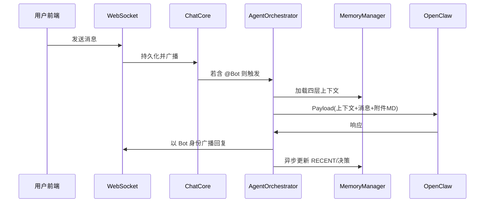

# AgentNexus 总体架构设计

> 来源：概要设计说明书 v2.0 §2（技术选型）、§3（系统总体架构）

## 1. 技术选型

### 1.1 为什么不直接基于 Mattermost

- Mattermost 为 Go 语言编写的完整产品，包含大量与本系统目标无关的企业功能（SAML、合规归档、看板、视频会议等）。
- 在其基础上二次开发需维护庞大 Go 代码库，技术栈碎片化（Go + Python），升级破坏性风险高。
- 本系统**参考** Mattermost 的 UX 设计、WebSocket 协议格式和 REST API 规范，使用 **Python 重新实现精简版**聊天核心，聚焦频道管理、实时消息、Bot 接入，其余一律不实现。

### 1.2 技术栈汇总

| 组件 | 技术选型 | 选型理由 |
|------|----------|----------|
| 聊天后端（自研） | Python + FastAPI + WebSocket | 与 Agent 框架语言统一，异步性能佳，维护成本低 |
| 前端 UI | React + Tailwind CSS | 参考 Mattermost/Slack 交互，组件化，易定制 |
| Agent 框架 | OpenClaw（+ CrewAI 协作理念） | OpenClaw 单 Agent 执行，CrewAI 指导多 Agent 编排 |
| Agent 编排层 | Python AgentOrchestrator（自研） | 参考 CrewAI 角色/任务/进程模型，管控多 Agent 协作 |
| 实时通信 | FastAPI WebSocket | 原生支持，无需额外中间件 |
| 消息队列 | Redis（轻量部署） | Bot 响应异步化，防止 LLM 等待阻塞 |
| 记忆存储 | SQLite + 结构化 MD 文件 | 主业务库与 Context Store 均用 SQLite；Context Store 为 SQLite + MD 双轨（附件二） |
| 向量检索（可选） | ChromaDB | 超长文档分块检索，初期可不启用 |
| 文件转换 | mammoth + pymupdf + openpyxl | docx/pdf/xlsx 转 Markdown |
| 容器编排 | Docker Compose | 一键启停，适合目标用户规模 |
| 管理后台 | React Admin（自研向导式） | 面向低技术能力管理员 |

---

## 2. 系统总体架构

### 2.1 六层架构

AgentNexus 分为六个层次，从上至下依次为：

| 层次 | 组件 | 核心职责 |
|------|------|----------|
| ① 用户交互层 | React 前端（Web/移动自适应） | 消息收发、文件上传、Bot 标识、Markdown 预览、@提及补全 |
| ② 实时通信层 | FastAPI WebSocket + REST API | 消息广播、连接管理、消息持久化、文件上传接口 |
| ③ Agent 编排层 | AgentOrchestrator（自研） | @提及路由、任务分配、多 Bot 协调、进程控制（顺序/并行） |
| ④ 记忆管理层 | MemoryManager（自研） | 四层记忆读写、上下文拼接注入、记忆摘要压缩 |
| ⑤ Agent 执行层 | OpenClaw 实例 × N | 对接 LLM、执行专业任务、返回结构化响应 |
| ⑥ 数据持久层 | SQLite + 文件存储 + ChromaDB（可选） | 消息历史与业务数据存 SQLite 主库；文件存储；Context Store 独立 SQLite；向量索引可选 |

### 2.2 核心数据流

文字描述：

1. 用户在前端发送消息 → WebSocket 推送到服务端  
2. ChatCore 持久化消息，广播到频道所有在线成员  
3. 若消息包含 @BotName，触发 AgentOrchestrator  
4. Orchestrator 从 MemoryManager 加载该频道四层上下文  
5. Orchestrator 构造 Payload（上下文 + 当前消息 + 附件 MD），发送给对应 OpenClaw 实例  
6. OpenClaw 调用 LLM 生成响应，返回给 Orchestrator  
7. Orchestrator 将响应以 Bot 身份通过 WebSocket 广播回频道  
8. MemoryManager 异步更新 RECENT 摘要，重要决策写入 DECISIONS  

### 2.3 与 Mattermost 的参考关系

| 参考方面 | Mattermost 原设计 | AgentNexus 实现方式 |
|----------|-------------------|----------------------|
| 频道模型 | Team > Channel > Message 三层 | 简化为 Workspace > Channel，去掉 Team |
| Bot Account | 独立 Bot 用户账号，头像与 @mention 名 | 完全保留，每个 OpenClaw 实例对应一个 Bot Account |
| Webhook | Outgoing/Incoming Webhook | 内化为 Orchestrator 内部调用，不暴露 Webhook URL |
| WebSocket | Go 原生实现 | FastAPI + websockets，接口格式参考 Mattermost |
| REST API | Mattermost REST API v4 | 参考 URL 与响应格式，自行实现核心子集 |
| 权限系统 | Team/Channel/Role 细粒度 | 简化为 Admin / Member / BotManager 三角色 |

---

## 3. 当前实现对齐（2026-03）

为避免与历史方案混淆，当前代码实现以以下事实为准：

- 内置 Bot 已统一为 `channel bot`（`bot-guide-001`），承担引导、协作与路由能力。
- 默认 Bot 执行主链路为 `LLMBotAdapter`（模型 + 模板）；OpenClaw HTTP/WS 适配器作为可选路径保留。
- 频道级新增 `auto_assist` 开关，可在未 @ 场景触发内置 Bot 接管。
- 消息链路除 WebSocket 外，已支持 SSE 流式接口：`/api/channels/{channel_id}/messages/stream`。
- 文件上传主路径为预签名上传（`/api/files/presign`），`/api/files/upload` 保留为兼容路径。
- 新增对象存储抽象层（`StorageProvider`）与 S3 兼容实现。
- 新增工作空间成员体系（`workspace_memberships`）与好友关系 API。
- 图片生成模块已落地（`/api/images/generate`、`/api/images/edit`、`/api/images/settings`）。
- MCP 配置导入能力已落地（`/api/mcp/preview`、`/api/mcp/parse-claude-config`）。
