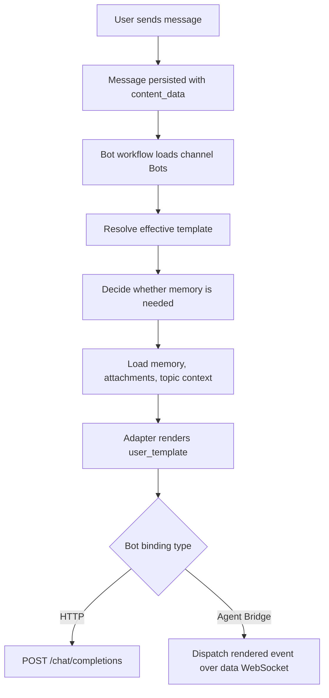

# Prompt Template Operations Guide

> **Language**: English | [中文](prompt-template-operations.zh-CN.md)

This guide explains how AgentNexus prompt templates are stored, selected, rendered, and operated. It reflects the current implementation in `backend/app/core/prompt_templates.py`, `backend/app/features/bot_runtime/adapters/prompt_template.py`, the Bot runtime pipeline, and the frontend settings UI.

## Scope

Prompt templates apply to normal configurable Bots:

- **HTTP Bots** call an OpenAI-compatible Chat Completions API with an AI model and prompt template.
- **Agent Bridge Bots** can use a prompt template to render the task text sent to the external provider.
- **Built-in Bots**, including `Coordinator`, use dedicated adapters first and do not depend on `AIModel` or `PromptTemplate` rows at runtime.

## Data Model

`PromptTemplate` is a reusable record in the `prompt_templates` table.

| Field | Meaning |
|---|---|
| `template_id` | Template primary key. |
| `name` | Unique display name. |
| `description` | Optional description shown in settings and pickers. |
| `system_prompt` | System instruction. Used as-is; template variables are not rendered here. |
| `user_template` | User message template. Supports `{{variable}}` placeholders. |
| `variables` | Metadata list used by the UI. Runtime rendering does not trust this list as the source of truth. |
| `is_builtin` | Built-in templates are seeded, localized for display, and read-only. |
| `created_by` | Owner user id. `NULL` means system/admin-created. |

Default user template:

```text
{{memory}}

{{message}}
```

The seeded built-in template is `template-general-001` (`General assistant` / `通用助手`).

## Rendering Rules

Only `user_template` is rendered through the shared renderer. The renderer matches placeholders with this shape:

```text
{{ variable_name }}
```

Variable names are word-style identifiers (`letters`, `digits`, and `_`). Spaces around the variable name are allowed.

Known variables are replaced. Unknown variables are preserved literally, so `{{unknown_var}}` remains in the final prompt. The rendered user text is stripped at both ends.

`system_prompt` is not rendered with template variables. For HTTP and Agent Bridge Bots, AgentNexus prepends the Bot identity before the selected system prompt:

```text
你在当前频道中的名称是「<bot display name or username>」。

<selected system prompt>
```

If `BotAccount.custom_system_prompt` is set, it overrides the template's `system_prompt`.

## Supported Variables

| Variable | Source |
|---|---|
| `message` | Final user text after secret replacement, document attachment text merge, and topic/reply context injection. |
| `memory` | XML block rendered from the loaded channel memory. Empty when no memory content is present or memory was not requested. |
| `anchor` | Project Anchor memory layer. |
| `progress` | Project Progress memory layer. |
| `decisions` | Decision Records memory layer. |
| `files_index` | Rendered file index layer. |
| `history` | Conversation history layer. |
| `todos` | Open todo layer. |
| `recent` | Deprecated alias for `history`. Kept for old templates. |
| `sender_name` | Display name or username of the triggering sender. |
| `channel_name` | Current channel name. |
| `channel_id` | Current channel id. |
| `bot_name` | Current Bot display name or username. |
| `timestamp` | Trigger message timestamp. |

The frontend autocomplete currently shows the common variables (`memory`, `message`, `sender_name`, `bot_name`, `channel_name`, `channel_id`, `timestamp`). The backend also supports the individual memory layer variables listed above.

Memory is rendered as compact XML, for example:

```xml
<channel_memory version="1">
  <layer name="anchor" label="Project Anchor">
    <content>...</content>
  </layer>
</channel_memory>
```

## Effective Template Priority

AgentNexus resolves the effective template in this order:

1. **Single-message override**: `Message.content_data.prompt_template_override_id`.
2. **Channel Bot override**: `ChannelMembership.template_id`, valid for the Bot membership in the current channel.
3. **Bot default template**: `BotAccount.template_id`.
4. **Fallback default user template**: only used where a template is optional, such as Agent Bridge Bots without a configured template.

A single-message override applies to all Bot targets triggered by that message. If the override is missing, unauthorized, or points to a deleted template, it is ignored and the pipeline falls back to channel/Bot defaults.

## Runtime Flow



Memory loading is template-aware. If the effective `user_template` contains `{{memory}}`, `{{recent}}`, or an individual memory layer variable, `ContextLoadStage` loads memory. If no target template asks for memory, memory loading is skipped to avoid unnecessary I/O.

## Frontend Operations

### Create Or Edit A Template

1. Open **Settings**.
2. Go to **Message templates**.
3. Select **New template** or an existing non-built-in template.
4. Fill in **Name**, **Description**, **System prompt**, and **User template**.
5. In **User template**, type `{{` to open variable suggestions.
6. Save.

Built-in templates are read-only and cannot be edited or deleted.

### Bind A Template To A Bot

1. Open **Settings**.
2. Go to **Bots**.
3. Create or edit a Bot.
4. For HTTP Bots, select both **AI model** and **Prompt template**.
5. For Agent Bridge Bots, select **Task template sent to the plugin** if the provider should receive rendered task text.
6. Save the Bot configuration.

HTTP Bots must have both `model_id` and `template_id`. Agent Bridge Bots do not use `model_id` and may omit `template_id`.

### Override A Bot Template In A Channel

1. Open the channel member panel.
2. Find the Bot member.
3. Use **Prompt template** to select a channel-level override.
4. Select **Default (bot-owned)** to clear the override.

Only the user who invited that Bot into the channel, or an admin, can edit that Bot membership's template override.

### Force A Template For One Message

1. In the message composer, use the `/` template control.
2. Pick a template.
3. Send the message.

The frontend writes this into `content_data`:

```json
{
  "prompt_template_override_id": "<template_id>",
  "prompt_template_override_name": "<template name>"
}
```

The backend uses only `prompt_template_override_id` for execution.

## API Operations

All endpoints are under `/api/v1` and require authentication.

### List Templates

```bash
curl -H "Authorization: Bearer <token>" \
  http://localhost:8000/api/v1/templates
```

Regular users see built-in templates, system/admin-created templates, and templates they created. Admins see all templates.

### Create Template

```bash
curl -X POST http://localhost:8000/api/v1/templates \
  -H "Authorization: Bearer <token>" \
  -H "Content-Type: application/json" \
  -d '{
    "name": "Project Analyst",
    "description": "Answer with project memory and current channel context",
    "system_prompt": "You are a project analyst. Be concise and cite uncertainty.",
    "user_template": "{{memory}}\n\nChannel: {{channel_name}}\nSender: {{sender_name}}\n\nQuestion:\n{{message}}",
    "variables": ["memory", "channel_name", "sender_name", "message"]
  }'
```

### Update Template

```bash
curl -X PATCH http://localhost:8000/api/v1/templates/<template_id> \
  -H "Authorization: Bearer <token>" \
  -H "Content-Type: application/json" \
  -d '{"user_template":"{{anchor}}\n\n{{message}}"}'
```

Built-in templates cannot be updated. Non-admin users can update only their own templates.

### Delete Template

```bash
curl -X DELETE http://localhost:8000/api/v1/templates/<template_id> \
  -H "Authorization: Bearer <token>"
```

When a non-built-in template is deleted, Bots that referenced it are detached by setting `BotAccount.template_id = NULL`. Channel membership overrides are not currently detached by the template service, so deletion can fail while any `ChannelMembership.template_id` still references that template. Clear channel Bot overrides before deleting templates that may be in active use.

### Create HTTP Bot With Template

```bash
curl -X POST http://localhost:8000/api/v1/bots \
  -H "Authorization: Bearer <token>" \
  -H "Content-Type: application/json" \
  -d '{
    "username": "project_analyst",
    "display_name": "Project Analyst",
    "binding_type": "http",
    "model_id": "<model_id>",
    "template_id": "<template_id>",
    "scope": "friend"
  }'
```

### Set Channel Bot Override

```bash
curl -X PATCH \
  http://localhost:8000/api/v1/channels/<channel_id>/members/<bot_id>/template \
  -H "Authorization: Bearer <token>" \
  -H "Content-Type: application/json" \
  -d '{"template_id":"<template_id>"}'
```

Clear it with:

```bash
curl -X PATCH \
  http://localhost:8000/api/v1/channels/<channel_id>/members/<bot_id>/template \
  -H "Authorization: Bearer <token>" \
  -H "Content-Type: application/json" \
  -d '{"template_id":null}'
```

### Send One Message With A Forced Template

```bash
curl -X POST http://localhost:8000/api/v1/channels/<channel_id>/messages \
  -H "Authorization: Bearer <token>" \
  -H "Content-Type: application/json" \
  -d '{
    "content": "@project_analyst summarize current risks",
    "sender_id": "<current_user_id>",
    "sender_type": "user",
    "mention_bot_ids": ["<bot_id>"],
    "msg_type": "normal",
    "content_data": {
      "prompt_template_override_id": "<template_id>"
    }
  }'
```

The streaming send endpoint (`/messages/stream`) currently does not accept arbitrary `content_data`, so use the normal message endpoint for forced template overrides.

## Template Examples

### Fast Bot Without Memory

```text
{{message}}
```

### Full Context Bot

```text
{{memory}}

You are answering in channel {{channel_name}} for {{sender_name}}.

User request:
{{message}}
```

### Layer-Specific Project Bot

```text
Project anchor:
{{anchor}}

Current progress:
{{progress}}

Relevant decisions:
{{decisions}}

Question:
{{message}}
```

### Agent Bridge Task Template

```text
Task from AgentNexus
Channel: {{channel_name}}
Sender: {{sender_name}}

Context:
{{memory}}

Task:
{{message}}
```

## Operational Checks

Use these checks when a Bot reply does not match the expected prompt behavior.

| Symptom | Check |
|---|---|
| Bot says it has no template | For HTTP Bots, confirm `BotAccount.template_id` is set and points to an existing template. |
| Template changes do not affect a channel | Check whether the Bot has a channel-level override in `ChannelMembership.template_id`. |
| One message used the wrong template | Inspect `Message.content_data.prompt_template_override_id`; invalid or unauthorized overrides are ignored. |
| Memory is missing | Confirm the effective `user_template` contains `{{memory}}`, `{{recent}}`, or one of `{{anchor}}`, `{{progress}}`, `{{decisions}}`, `{{files_index}}`, `{{history}}`, `{{todos}}`. |
| System prompt variables were not replaced | Expected behavior: system prompts are not template-rendered. Move dynamic content into `user_template`. |
| Agent Bridge provider receives plain text instead of template text | Confirm the Bot has a template or channel/message override. If omitted, Agent Bridge falls back to the default `{{memory}}\n\n{{message}}`. |
| Built-in Coordinator ignores selected model/template | Expected behavior: built-in adapters take priority over model/template bindings. |

## Development Notes

- Shared defaults: `backend/app/core/prompt_templates.py`.
- Template renderer and variable context: `backend/app/features/bot_runtime/adapters/prompt_template.py`.
- HTTP prompt assembly: `backend/app/features/bot_runtime/adapters/http_bot.py`.
- Agent Bridge prompt assembly: `backend/app/features/bot_runtime/adapters/agent_bridge_bot.py`.
- Effective template resolution: `backend/app/features/bot_runtime/pipeline/workflow.py`.
- Memory gating: `backend/app/features/bot_runtime/pipeline/bot/stages/context_load.py`.
- Template API: `backend/app/api/v1/templates/routes.py`.
- Frontend template management: `frontend/src/features/settings/templates/TemplateListSubPane.tsx`.
- Composer forced override: `frontend/src/App.tsx` and `frontend/src/components/MessageComposer.tsx`.

Recommended regression tests:

```bash
cd backend
pytest ../tests/test_template_vars.py ../tests/test_pipeline_context_load.py ../tests/test_bot_scope.py -q
```

For end-to-end confidence, run the full integration suite against a Docker Compose stack as described in `AGENTS.md`.
