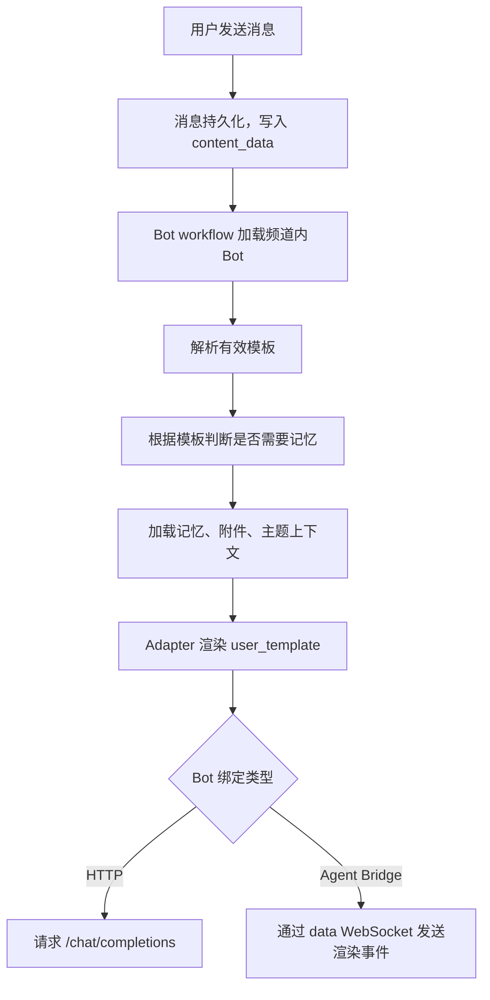

# AgentNexus 提示词模板操作文档

> **语言**：中文 | [English](prompt-template-operations.md)

本文说明 AgentNexus 中提示词模板的存储、选择、渲染与操作方式。内容基于当前代码实现核对，主要涉及 `backend/app/core/prompt_templates.py`、`backend/app/features/bot_runtime/adapters/prompt_template.py`、Bot 运行流水线以及前端设置界面。

## 适用范围

提示词模板主要作用于可配置 Bot：

- **HTTP Bot**：按 Bot 绑定的 AI 模型和提示词模板，调用 OpenAI 兼容 Chat Completions API。
- **Agent Bridge Bot**：可使用提示词模板把 AgentNexus 消息渲染成最终任务文本，再发送给外部 provider。
- **内置 Bot**：例如 `Coordinator`，运行时优先使用专用 adapter，不依赖数据库里的 `AIModel` 或 `PromptTemplate` 记录。

## 数据模型

`PromptTemplate` 是 `prompt_templates` 表中的可复用记录。

| 字段 | 说明 |
|---|---|
| `template_id` | 模板主键。 |
| `name` | 模板显示名，要求唯一。 |
| `description` | 可选说明，会显示在设置页和选择器中。 |
| `system_prompt` | 系统提示词。按原文使用，不会渲染 `{{变量}}`。 |
| `user_template` | 用户消息模板，支持 `{{变量}}` 占位符。 |
| `variables` | UI 元数据列表。运行时以模板正文实际出现的变量为准，不以该列表为准。 |
| `is_builtin` | 是否内置模板。内置模板由种子数据维护，前端只读，不允许修改或删除。 |
| `scope` | 模板可见范围：`private`、`friend` 或 `everyone`。 |
| `created_by` | 创建者用户 ID。为空表示系统/管理员创建。 |

模板权限与 Bot 权限保持一致：

- `private`：仅创建者和管理员可使用。
- `friend`：创建者、管理员、创建者的已通过好友可使用。
- `everyone`：所有已登录用户可使用。
- 内置模板和无创建者的系统模板对所有用户可用，且只读。

模板列表/详情、Bot 绑定模板、频道 Bot 覆盖模板、单条消息强制模板都会使用同一套权限检查。

默认用户模板为：

```text
{{memory}}

{{message}}
```

当前种子数据会创建一个内置通用模板：`template-general-001`（`General assistant` / `通用助手`）。

## 渲染规则

系统只对 `user_template` 做变量渲染。渲染器识别以下形式：

```text
{{ variable_name }}
```

变量名使用普通标识符风格，支持字母、数字和下划线；变量名前后的空格允许存在。

已知变量会被替换。未知变量会原样保留，例如 `{{unknown_var}}` 最终仍会出现在提示词中。渲染后的用户消息会执行首尾 `strip()`。

`system_prompt` 不参与变量渲染。HTTP Bot 和 Agent Bridge Bot 在使用系统提示词前，会统一在前面加上 Bot 身份：

```text
你在当前频道中的名称是「<Bot 显示名或 username>」。

<选中的 system_prompt>
```

如果 `BotAccount.custom_system_prompt` 有值，则它会覆盖模板里的 `system_prompt`。

## 支持的变量

| 变量 | 来源 |
|---|---|
| `message` | 最终用户文本。进入模板前，可能已经完成密文替换、文档附件文本合并、主题/回复上下文注入。 |
| `memory` | 从频道记忆渲染出的 XML 块。没有记忆内容或本次未请求记忆时为空。 |
| `anchor` | Project Anchor 记忆层。 |
| `progress` | Project Progress 记忆层。 |
| `decisions` | Decision Records 记忆层。 |
| `files_index` | 文件索引层。 |
| `history` | 对话历史层。 |
| `todos` | 待办层。 |
| `recent` | 已废弃兼容变量，当前等价于 `history`。 |
| `sender_name` | 触发消息发送者的显示名或用户名。 |
| `channel_name` | 当前频道名称。 |
| `channel_id` | 当前频道 ID。 |
| `bot_name` | 当前 Bot 的显示名或用户名。 |
| `timestamp` | 触发消息时间戳。 |

前端输入 `{{` 时目前只提示常用变量：`memory`、`message`、`sender_name`、`bot_name`、`channel_name`、`channel_id`、`timestamp`。后端同时支持上表中的单独记忆层变量，可手动输入。

`memory` 会被渲染为紧凑 XML，例如：

```xml
<channel_memory version="1">
  <layer name="anchor" label="Project Anchor">
    <content>...</content>
  </layer>
</channel_memory>
```

## 生效优先级

一次 Bot 调用的有效模板按以下顺序选择：

1. **单条消息强制模板**：`Message.content_data.prompt_template_override_id`。
2. **频道内 Bot 覆盖模板**：当前频道 Bot 成员关系上的 `ChannelMembership.template_id`。
3. **Bot 默认模板**：`BotAccount.template_id`。
4. **默认用户模板兜底**：只用于模板可选的场景，例如未配置模板的 Agent Bridge Bot。

单条消息强制模板会作用于该消息触发的所有目标 Bot。如果指定的模板不存在、无权限或为空，后端会忽略该覆盖，继续回退到频道覆盖或 Bot 默认模板。

## 运行时链路



记忆加载是模板感知的。只有有效 `user_template` 中出现 `{{memory}}`、`{{recent}}` 或某个单独记忆层变量时，`ContextLoadStage` 才会加载记忆。没有任何目标模板请求记忆时，系统会跳过记忆加载，以减少不必要的 I/O。

## 前端操作

### 创建或编辑模板

1. 打开 **Settings / 设置**。
2. 进入 **Message templates / 消息模板**。
3. 点击 **New template / 新模板**，或选择一个非内置模板。
4. 填写 **Name / 名称**、**Description / 描述**、**Visibility / 可见范围**、**System prompt / 系统提示词**、**User template / 用户模板**。
5. 在 **User template** 中输入 `{{` 可打开变量提示。
6. 保存。

内置模板和你不拥有的共享模板在设置页只读，不能修改或删除。

### 为 Bot 绑定模板

1. 打开 **Settings / 设置**。
2. 进入 **Bots**。
3. 新建或编辑 Bot。
4. HTTP Bot 必须选择 **AI model** 和 **Prompt template**。
5. Agent Bridge Bot 可选择 **Task template sent to the plugin**，用于把消息渲染成发送给外部 provider 的任务文本。
6. 保存 Bot 配置。

HTTP Bot 必须同时有 `model_id` 和 `template_id`。Agent Bridge Bot 不使用 `model_id`，`template_id` 可以为空。
创建或更新 Bot 时，所选模板必须对当前用户可见。

### 为频道内某个 Bot 设置模板覆盖

1. 打开频道成员面板。
2. 找到 Bot 成员。
3. 在 **Prompt template** 下拉框中选择频道级覆盖模板。
4. 选择 **Default (bot-owned)** 可清除覆盖，恢复 Bot 默认模板。

只有邀请该 Bot 进入频道的人，或管理员，能修改这个 Bot 成员关系上的模板覆盖。
所选覆盖模板也必须对执行修改的用户可见。

### 为单条消息强制使用模板

1. 在消息输入框工具栏点击 `/` 模板控件。
2. 选择一个模板。
3. 发送消息。

前端会把以下数据写入 `content_data`：

```json
{
  "prompt_template_override_id": "<template_id>",
  "prompt_template_override_name": "<template name>"
}
```

后端实际执行时只读取 `prompt_template_override_id`。
如果发送者无权使用该模板，后端会忽略本次覆盖，并按正常优先级回退。

## API 操作

以下接口均位于 `/api/v1` 下，且需要认证。

### 查看模板列表

```bash
curl -H "Authorization: Bearer <token>" \
  http://localhost:8000/api/v1/templates
```

普通用户能看到内置/系统模板、自己创建的模板、好友开放的 `friend` 模板，以及 `everyone` 模板。管理员能看到全部模板。

### 创建模板

```bash
curl -X POST http://localhost:8000/api/v1/templates \
  -H "Authorization: Bearer <token>" \
  -H "Content-Type: application/json" \
  -d '{
    "name": "Project Analyst",
    "description": "结合项目记忆和当前频道上下文回答问题",
    "system_prompt": "你是项目分析助手。请简洁回答，并明确不确定信息。",
    "user_template": "{{memory}}\n\n频道：{{channel_name}}\n提问人：{{sender_name}}\n\n问题：\n{{message}}",
    "variables": ["memory", "channel_name", "sender_name", "message"],
    "scope": "friend"
  }'
```

### 更新模板

```bash
curl -X PATCH http://localhost:8000/api/v1/templates/<template_id> \
  -H "Authorization: Bearer <token>" \
  -H "Content-Type: application/json" \
  -d '{"user_template":"{{anchor}}\n\n{{message}}","scope":"everyone"}'
```

内置模板不能更新。非管理员只能更新自己创建的模板。

### 删除模板

```bash
curl -X DELETE http://localhost:8000/api/v1/templates/<template_id> \
  -H "Authorization: Bearer <token>"
```

删除非内置模板时，引用该模板的 Bot 和频道 Bot 覆盖会被解绑，即 `BotAccount.template_id` 和 `ChannelMembership.template_id` 会被置空。

### 创建绑定模板的 HTTP Bot

```bash
curl -X POST http://localhost:8000/api/v1/bots \
  -H "Authorization: Bearer <token>" \
  -H "Content-Type: application/json" \
  -d '{
    "username": "project_analyst",
    "display_name": "项目分析助手",
    "binding_type": "http",
    "model_id": "<model_id>",
    "template_id": "<template_id>",
    "scope": "friend"
  }'
```

### 设置频道内 Bot 模板覆盖

```bash
curl -X PATCH \
  http://localhost:8000/api/v1/channels/<channel_id>/members/<bot_id>/template \
  -H "Authorization: Bearer <token>" \
  -H "Content-Type: application/json" \
  -d '{"template_id":"<template_id>"}'
```

清除覆盖：

```bash
curl -X PATCH \
  http://localhost:8000/api/v1/channels/<channel_id>/members/<bot_id>/template \
  -H "Authorization: Bearer <token>" \
  -H "Content-Type: application/json" \
  -d '{"template_id":null}'
```

### 发送单条强制模板消息

```bash
curl -X POST http://localhost:8000/api/v1/channels/<channel_id>/messages \
  -H "Authorization: Bearer <token>" \
  -H "Content-Type: application/json" \
  -d '{
    "content": "@project_analyst 总结当前风险",
    "sender_id": "<current_user_id>",
    "sender_type": "user",
    "mention_bot_ids": ["<bot_id>"],
    "msg_type": "normal",
    "content_data": {
      "prompt_template_override_id": "<template_id>"
    }
  }'
```

当前 `/messages/stream` 流式发送接口不接收任意 `content_data`，因此需要强制模板覆盖时，应使用普通消息发送接口。

## 模板示例

### 不加载记忆的快速 Bot

适合只回答当前消息、避免加载频道记忆的 Bot：

```text
{{message}}
```

### 使用完整上下文的 Bot

```text
{{memory}}

你正在频道 {{channel_name}} 中回答 {{sender_name}}。

用户请求：
{{message}}
```

### 只使用特定记忆层的项目 Bot

```text
项目锚点：
{{anchor}}

当前进展：
{{progress}}

关键决策：
{{decisions}}

问题：
{{message}}
```

### Agent Bridge 任务模板

```text
来自 AgentNexus 的任务
频道：{{channel_name}}
发送者：{{sender_name}}

上下文：
{{memory}}

任务：
{{message}}
```

## 排障检查表

| 现象 | 检查项 |
|---|---|
| Bot 提示“未配置提示词模板” | HTTP Bot 必须设置 `BotAccount.template_id`，且模板记录存在。 |
| 修改 Bot 默认模板后频道里没生效 | 检查该频道 Bot 成员是否设置了 `ChannelMembership.template_id` 覆盖。 |
| 单条消息没有使用选中的模板 | 检查 `Message.content_data.prompt_template_override_id`；无效、无权限或已删除的覆盖会被忽略。 |
| 记忆没有进入提示词 | 确认有效 `user_template` 中包含 `{{memory}}`、`{{recent}}` 或 `{{anchor}}`、`{{progress}}`、`{{decisions}}`、`{{files_index}}`、`{{history}}`、`{{todos}}` 之一。 |
| `system_prompt` 中的变量没有替换 | 这是当前设计：系统提示词不做模板渲染。需要动态内容时放到 `user_template`。 |
| Agent Bridge provider 收到的文本不是预期模板 | 检查 Bot 默认模板、频道覆盖和单条消息覆盖。未配置模板时，Agent Bridge 会使用默认 `{{memory}}\n\n{{message}}`。 |
| 内置 `Coordinator` 不受模型/模板配置影响 | 这是当前设计：内置 adapter 优先，运行时不读取 `AIModel` / `PromptTemplate`。 |

## 开发维护要点

- 共享默认值：`backend/app/core/prompt_templates.py`。
- 模板渲染和变量上下文：`backend/app/features/bot_runtime/adapters/prompt_template.py`。
- HTTP Bot 组装提示词：`backend/app/features/bot_runtime/adapters/http_bot.py`。
- Agent Bridge 组装提示词：`backend/app/features/bot_runtime/adapters/agent_bridge_bot.py`。
- 有效模板解析：`backend/app/features/bot_runtime/pipeline/workflow.py`。
- 记忆加载门控：`backend/app/features/bot_runtime/pipeline/bot/stages/context_load.py`。
- 模板 API：`backend/app/api/v1/templates/routes.py`。
- 前端模板管理：`frontend/src/features/settings/templates/TemplateListSubPane.tsx`。
- 单条消息强制模板：`frontend/src/App.tsx` 和 `frontend/src/components/MessageComposer.tsx`。

建议回归测试：

```bash
cd backend
pytest ../tests/test_template_vars.py ../tests/test_pipeline_context_load.py ../tests/test_bot_scope.py -q
pytest ../tests/test_template_scope.py -q
```

需要端到端确认时，应按 `AGENTS.md` 要求启动完整 Docker Compose 栈后运行集成测试。
