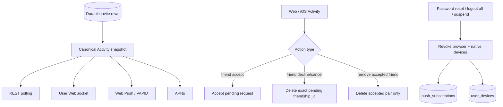

# Cheers Issue 470 通知邀请与推送安全修复

## 一句话总结

本次改动修复了 Activity 邀请不同步、陈旧好友请求可能误删已接受关系、全局会话撤销未同步清理 APNs 设备三个问题，并通过 1Password secret references 在本地 Gateway 中真正启用了 APNs 与 Web Push。

## 背景与问题

### Issue #470：频道邀请没有稳定进入 Activity

Activity 过去过度依赖实时 WebSocket 事件：页面首次打开、断线重连、标签页恢复或多设备并发处理时，客户端可能看不到数据库中仍然存在的邀请，或者被较晚返回的旧 REST 响应覆盖。

频道邀请还存在两阶段生命周期：用户尚未加入 workspace 时，private channel invite 应先排队；workspace membership 变为 active 后才应出现在 Activity。普通频道邀请和两阶段邀请需要共享同一个 durable snapshot，而不能依赖临时前端状态。

### 陈旧好友请求拒绝可能删除已接受关系

原先“删除好友、拒绝来访请求、取消外发请求”共用：

```text
DELETE /api/v1/friends?friend_id=...
```

服务端按用户 pair 无条件删除 `friendships` 行。若设备 A 已接受请求，而离线设备 B 随后点击旧 Activity 中的“拒绝”，旧操作会把已经建立的好友关系删掉。

### 会话撤销没有完整撤销 APNs

修改密码、重置密码、全局登出和管理员封禁过去只删除 Web Push subscriptions。iOS 的 `user_devices` 仍然保留；丢失设备、离线设备或被封禁账号仍可能收到 APNs。

发送端查询也只按 `user_id` 读取 device token，没有把 suspended/deleted 用户作为最后一道防线过滤。

### 推送代码存在，但运行环境未启用

Gateway 日志曾显示：

```text
VAPID_PRIVATE_KEY unset — Web Push disabled
push not configured — OS push disabled
```

代码路径存在，但 Compose 没有完整传递 VAPID/APNs/Relay 配置，本地 `.env` 也没有真实凭据。

## 最终设计



## 1. Activity 邀请收敛

### Canonical durable snapshot

Gateway 的 `load_notifications(db, user_id)` 成为 REST、WebSocket、Web Push、APNs 和集成测试共同使用的 Activity 数据边界。通知表不是第二份真相来源；friendship、workspace membership、channel invite、bot channel invite 的 durable rows 才是 source of truth。

覆盖的通知类型：

- `friend_request`
- `workspace_invite`
- `channel_invite`
- `bot_channel_invite`

两阶段 channel invite 在 workspace membership 为 `active` 前保持隐藏，激活后由同一 snapshot 解锁并投递。

### 前端刷新策略

Activity 会在以下时机重新拉取：

- 页面挂载
- 每 60 秒
- 窗口 focus
- 浏览器 online
- 标签页重新 visible
- 用户 WebSocket 重连

`notificationStore` 增加 live revision 和 refresh sequence：

- WebSocket 新事件到达后，较早发出的 REST 响应不能覆盖实时状态。
- 多个并发 refresh 中，只有最新请求可以提交结果。
- `notification_resolved` 被视为 terminal event，跨设备接受/拒绝后立即移除旧 Activity。

## 2. 好友请求竞态修复

### 专用 decline/cancel 接口

新增：

```text
DELETE /api/v1/friends/requests/:friendship_id
```

数据库删除条件是原子且收敛的：

```sql
WHERE friendship_id = $1
  AND status = 'pending'
  AND (user_id = $2 OR friend_id = $2)
```

调用者是 requester 时语义为 cancel；调用者是 target 时语义为 decline。若请求已被其他设备接受，`status = 'pending'` 不再成立，陈旧操作只返回未删除，不会回退关系状态。

通知 DTO 新增 `friendship_id`，Web 与 iOS 都按 Activity 中的精确 ID 调用专用接口。

### 通用删除接口收窄

原 `DELETE /friends?friend_id=...` 现在只删除：

```sql
status = 'accepted'
```

因此三种业务语义不再共用无条件删除：

| 操作 | 身份依据 | 状态限制 |
|---|---|---|
| 接受请求 | requester user ID + pair | `pending`，且调用者是 target |
| 拒绝/撤回请求 | `friendship_id` | `pending`，且调用者属于该请求 |
| 删除好友 | user pair | `accepted` |

## 3. APNs 撤销与发送端防线

新增 `revoke_user_devices(db, user_id)`，删除该用户的所有 `user_devices`。它和 Web Push subscription revoke 一起用于：

- 修改密码
- 重置密码
- `/auth/logout` 全局撤销
- `/auth/logout-all`
- 管理员 suspend user

`logout-current` 不删除所有设备，因为单个 auth session 与 APNs device registration 当前没有稳定的一对一映射；普通 iOS 主动登出仍由客户端删除当前设备 registration。

APNs token 查询增加用户状态过滤：

```sql
JOIN users u ON u.user_id = d.user_id
WHERE u.is_suspended = FALSE
  AND u.is_deleted = FALSE
```

即使某次撤销写入失败，发送端也不会继续选择被封禁或已删除用户的 token，形成 defense in depth。

## 4. APNs 与 Web Push 实际启用

### Compose 配置

Gateway Compose 环境现在支持：

- `APNS_KEY_P8`
- `APNS_KEY_ID`
- `APNS_TEAM_ID`
- `APNS_TOPIC`
- `APNS_SANDBOX`
- `VAPID_PRIVATE_KEY`
- `VAPID_SUBJECT`
- `PUSH_RELAY_URL`
- `PUSH_RELAY_KEY`

`.env.example` 同步记录了生成方式和配置语义。

### 1Password secret references

Apple Developer 凭据继续保存在 1Password；VAPID 使用独立的 `Cheers Web Push VAPID` 条目。项目本地通过被 Git 忽略的 `.env.1password` 保存 `op://...` 引用，而不是明文私钥。

运行方式：

```bash
op run --env-file .env.1password -- docker compose up ...
```

真实值只在 `op run` 创建的进程环境中展开，并由 Docker Compose 传递给 Gateway。仓库、终端输出和本笔记都不保存私钥。

当前本地 iOS 开发环境使用 `APNS_SANDBOX=true`。TestFlight/App Store device token 应使用 production APNs，即 `APNS_SANDBOX=false`。

### 启动验证

最终 Gateway 状态：

```text
healthy
push transport: direct APNs
```

容器内确认以下变量均存在，但检查过程不输出值：

- VAPID private key / subject
- APNs `.p8` / key ID / team ID

日志中不存在以下错误：

- `VAPID_PRIVATE_KEY unset`
- `not a valid P-256 private-key PEM`
- `push not configured`
- `incomplete APNS_*`
- `APNS_KEY_P8 is not a valid EC key`

## 迁移链同步事件

第一次重建时 Gateway 被 sqlx 阻止启动：数据库已有 migration 70/71，但修复分支仍基于 migration 69。没有删除 `_sqlx_migrations` 记录，也没有伪造或修改已应用迁移。

正确处理方式：

1. 获取最新 `origin/develop`。
2. 确认 migration 70 是 `channel conversation mode`，71 是 `discussion threads`。
3. 用 stash 保护本次修改，明确排除用户的无关 ZIP 和本地秘密引用。
4. 将分支更新到最新 `develop`。
5. 重新应用修改；Git 自动合并，无代码冲突。
6. 再次无缓存构建并强制 recreate Gateway。

这次事件再次说明：sqlx migrations 是数据库协议链，运行数据库和构建镜像必须来自一致的提交历史。

## 验证结果

### 自动化测试

- Frontend：24 个测试文件、164 项测试通过
- Frontend TypeScript typecheck：通过
- Gateway Rust：256 项单元测试通过
- iOS generic simulator build：通过
- `cargo fmt --all --check`：通过
- `git diff --check`：通过

### PostgreSQL 回归测试

新增并通过：

1. `stale_friend_decline_cannot_delete_an_accepted_friendship`
   - 构造 pending request。
   - 先更新为 accepted，模拟设备 A 接受。
   - 再由设备 B 执行旧 decline。
   - 断言删除结果为空，friendship 仍为 accepted。

2. `native_push_devices_are_revoked_and_suspended_users_are_filtered`
   - 注册 iOS device token。
   - suspend 用户后断言 active token 查询为空。
   - 执行全局 revoke 后断言 `user_devices` 行被删除。

### Invite 生命周期覆盖

- 普通 active workspace member 的 channel invite 立即进入 Activity。
- workspace 尚 pending 时 channel invite 保持排队且隐藏。
- workspace 接受后 channel invite 解锁。
- 接受/拒绝删除 durable invite 后，REST snapshot 不再返回该项。
- WS `notification_resolved` 让其他设备立即收敛。

## 主要代码位置

### Gateway

- `server/src/api/notifications.rs`
- `server/src/api/friends.rs`
- `server/src/api/auth.rs`
- `server/src/api/users.rs`
- `server/src/notify/mod.rs`
- `server/src/router.rs`
- `server/src/gateway/realtime/frame.rs`
- `server/tests/flows.rs`

### Frontend

- `frontend/src/api/notifications.ts`
- `frontend/src/api/friends.ts`
- `frontend/src/stores/notificationStore.ts`
- `frontend/src/features/chat/ChatLayout.tsx`
- `frontend/src/features/chat/hooks/useUserSocket.ts`
- `frontend/src/features/friends/FriendsPage.tsx`

### iOS

- `apps/ios/Sources/Models/DTOs.swift`
- `apps/ios/Sources/Networking/APIClient.swift`
- `apps/ios/Sources/State/ActivityModel.swift`
- `apps/ios/Sources/Views/FriendsView.swift`

### 配置

- `.env.example`
- `.gitignore`
- `docker-compose.yml.template`
- 本地 ignored：`.env.1password`

## 当前状态与后续建议

- 分支：`codex/issue-470-channel-invites`
- 基线：最新 `origin/develop`，包含 migration 70/71
- Gateway：本地 healthy，APNs 与 VAPID 已启用
- 修改：尚未 commit / push / 创建 PR
- `research-novelty-review.zip`：未触碰，不属于本次范围
- 安全备份：保留了一份本次工作区 stash；提交确认后可删除重复备份

建议在合并前补充两项现场验证：

1. 用两台设备复现“设备 A 接受、设备 B 点击旧拒绝”，确认 UI 最终都显示 accepted friendship。
2. 用真实 iPhone 注册 sandbox APNs token，触发 Activity push；随后执行 logout-all 或 suspend，确认该设备不再收到通知。
