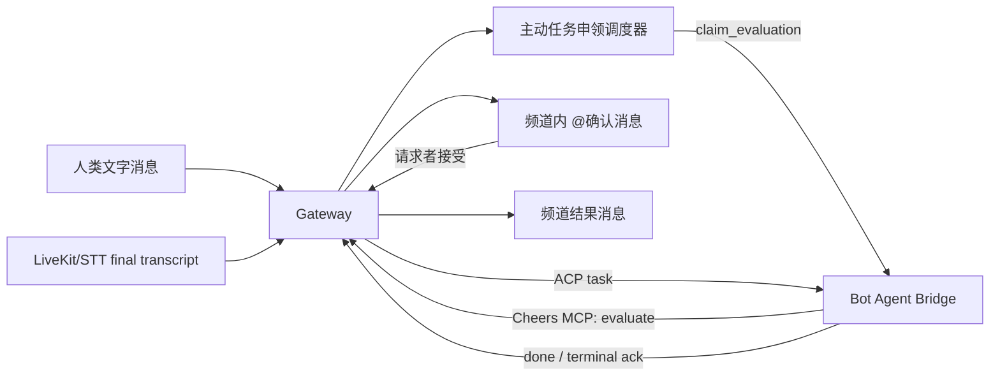

# Cheers 主动任务申领与实时语音协作

## 一句话总结

在多人文字或语音协作频道中，Bot 通过 Agent Bridge 接收系统调度的活动批次并判断“是否有适合自己执行的任务”。命中后，Bot 通过 Cheers MCP 创建一条 @ 请求者的频道内确认消息；用户接受后，Gateway 通过 ACP/Agent Bridge 下发任务，Bot 执行并把结果回写到频道。

## 核心架构



职责边界：

- Bot 自己通过 Agent Bridge 接收评估请求和任务；系统负责调度、节流、持久化和权限控制。
- ACP 负责会话、任务和结果传输，不承担频道级监听策略或人工审批状态机。
- Cheers MCP 的 `channel.task_claims.evaluate` 是申领决策写回 Gateway 的唯一入口；Gateway 仍负责校验、持久化、消息广播和任务派发。
- 语音频道沿用同一频道事件时钟，final transcript 与文字消息进入统一调度输入。

## 已实现能力

### 1. 频道级监听策略

每个 `channel + bot` 独立配置：

- `mode`: `off`、`text`、`text_and_transcript`、`all_activity`
- `scope`: 给 Bot 的任务范围说明
- `debounce_seconds`: 新活动稳定后等待时间
- `min_interval_seconds`: 两次评估之间的最小间隔
- `max_evaluations_per_hour`: 小时预算
- `batch_size`: 单次评估最多活动条数
- `confidence_threshold`: 低于阈值的申领不进入审批

调度器具备 durable cursor、批量合并、在线状态检查、小时预算、租约恢复和失败回滚。

### 2. 申领与确认状态机

```text
reserved -> dispatched -> completed
                      \-> failed

claim request:
pending -> accepted -> executing -> completed
        \-> rejected
        \-> failed
```

调度评估本身不产生普通聊天消息；命中后才在主消息流创建带 @ 的确认卡片。忽略、低置信度和失败结果均只写入 ViewBoard Activity。接受动作会广播 `task_claim_updated`，前端实时刷新确认卡片。

### 3. Agent Bridge / ACP 扩展

新增评估与结果事件：

- `claim_evaluation`
- `claim_evaluation_result`
- `task_claim_ack`

隔离评估阶段只暴露受限的 Cheers MCP 决策工具，不接受权限请求；只有请求者接受后才进入正式任务派发。

### 4. 实时语音频道

- LiveKit 负责实时语音媒体平面。
- STT Worker 写入 final transcript segment。
- transcript 使用频道 `channel_seq`，因此可以和文字活动统一排序、恢复和调度。
- 语音任务申领与文字任务申领共用审批、ACP 下发和结果回写链路。

## 本次验证结果

### 自动化测试

- Gateway Rust：185 个测试全部通过
- Rust Connector：117 个测试全部通过
- Frontend：90 个测试及生产构建通过
- `cargo fmt --check`、`cargo check` 通过
- Docker Compose 配置校验通过
- Gateway 无缓存镜像构建并健康启动

### E2E 场景

1. 文字消息触发评估，Bot 返回 claim，人工批准后收到 ACP task，Bot 回写完成结果。
2. 语音 final transcript 触发评估，人工拒绝后没有任务下发。
3. 重复批准返回 `409`，没有重复执行。
4. 内部 `is_secret` 触发消息不会被公开消息列表返回。
5. 新建频道时传入 `initial_bot_ids`，Bot 自动拥有 PRIMARY session。
6. 未认证请求返回 `401`。
7. 非法监听频率配置返回 `400`。
8. Gateway、Postgres、Redis、RustFS、Frontend 全部健康；Gateway 日志无 ERROR、panic、FATAL。

## 验证期间修复的问题

- 修复新建频道初始 Bot 未创建 PRIMARY session 的契约缺口。
- 修复审批先改状态、后检查 session 导致申领卡死为 `accepted` 的问题。
- 修复普通消息历史接口泄露 `is_secret` 内部触发消息的问题。
- 修复 `docker-compose.yml.template` 的 Gateway build context 与 Dockerfile 路径不匹配问题。

对应提交：`78a8a5b6 fix: harden proactive claim execution`

## 当前限制与下一步

本次 E2E 已覆盖 transcript 写入后的完整任务申领闭环；尚未在真实麦克风、LiveKit SFU、STT Worker 的媒体链路上做现场音频测试。上线前建议补充：

- 一台独立 LiveKit 主机上的真实浏览器麦克风通话测试
- STT Worker 断线、重连、重复 webhook 测试
- 多 Bot 竞争同一任务时的优先级或抢占策略测试
- 前端审批卡片在多人同时操作时的冲突提示测试
- 2G 服务器上的资源监控、连接数和并发语音压测

## 部署建议

当前阶段继续使用 Docker Compose 即可。LiveKit、Gateway、Postgres、Redis、RustFS、STT Worker 可以按资源拆分到不同主机；当需要多副本 Gateway、自动扩缩容、跨节点故障转移时，再迁移到 Kubernetes。

## 相关代码

- `server/src/gateway/task_claim_scheduler.rs`
- `server/src/api/task_claims.rs`
- `server/src/api/channels.rs`
- `server/src/domain/messages.rs`
- `server/migrations/0057_proactive_task_claims.sql`
- `packages/cheers-acp-connector-rs/`
- `frontend/`

## 2026-07-21 状态更新

自动认领任务已完成 C1–C4 的实现，当前分支新增以下提交：

- `612104e2`：申领生命周期治理、过期清理、立即触发与 quiet hours
- `9ee7816f`：语音转写保留、审计、导出/删除与语音配置
- `96293048`：MCP Tool、Resource verb 与 capability flag（Phase C4）

当前状态：功能已进入 PR 前收尾阶段。核心文字/语音申领闭环此前已完成 E2E 验证；由于上述最新改动尚未重新跑完整测试，提交 PR 前需要补跑 Gateway、Connector、Frontend 和相关迁移检查。

当前工作区存在 6 个未提交文件，属于其他进行中的变更，未纳入本次自动认领任务 PR：

- `.claude/launch.json`
- `.github/workflows/ci.yml`
- `.github/workflows/release-desktop.yml`
- `apps/macos/scripts/build-sidecar.sh`
- `apps/macos/src-tauri/tauri.conf.json`
- `packages/cheers-acp-connector-rs/src/bridge_runtime/prompt.rs`

PR 目标范围是当前分支相对远端的 3 个 claims/voice 提交及本总结文档。GitHub MCP 可以负责创建 Draft PR；本地 Git 仍需先推送分支。

### 最新检查记录

- Gateway `cargo check`：通过
- Gateway `cargo test`：185 通过
- Connector `cargo test`：118 通过
- Frontend `npm test`：90 通过
- Frontend `npm run build`：通过
- Frontend `npm run typecheck`：被现有 `PdfViewer.tsx` 的 `pdfjs` 类型错误阻断，与本次 claims 改动无关
- Gateway `cargo fmt --check`：被当前未提交文件中的格式差异阻断，未自动修改这些文件

## 2026-07-21 本地申领链路修复与复验

### 已验证闭环

`频道文字消息 → 调度器 → OpenCode/DeepSeek → Cheers MCP evaluate → @请求者确认消息 → 接受后任务执行` 已在本地真实 Bot 容器中跑通。

- Gateway Rust 测试：185 passed。
- Connector 测试：118 passed。
- Gateway 以无缓存镜像重建并健康启动；数据库迁移已应用。
- 最终评估状态为 `completed`，确认消息已持久化为 `task_claim_confirmation`，对应申领进入 `executing`。

### 本次根因与修复

1. **陈旧 ACP session**：Bot 容器重启后，持久化的 provider session 映射可能指向 OpenCode 中不存在的 session。Connector 现会在 `session/load` 失败时清除该映射并创建新 session；任务申领评估不会再向 Gateway 上报无效的普通会话更新。
2. **确认消息类型长度不足**：`messages.msg_type` 原为 `VARCHAR(16)`，无法写入 `task_claim_confirmation`。新增迁移 `0061_expand_message_type_for_task_claim_confirmation.sql`，将该列扩展至 `VARCHAR(64)`；不修改已应用迁移。
3. **中断评估无法重试**：租约恢复会回退 cursor，但唯一键阻止为同一活动范围插入新 evaluation。调度器现会重新激活已有 `failed` evaluation，复用其 ID 并保留 Activity 审计记录。
4. **可观测性**：ViewBoard Activity 会记录 `ignored`、`failed`、`completed`；空模型输出显示为 `bot session ended without a task-claim decision`，便于区分模型/会话故障与“不申领”。

### 后续：真实语音验证

文字申领已完成真实容器验证。下一阶段验证真实麦克风 → LiveKit 房间 → STT Worker final transcript → 相同调度器 → 确认卡片的媒体链路；这与此前仅注入 transcript 的 E2E 验证不同。

### 本地真实媒体配置（进行中）

- 浏览器媒体端点：`LIVEKIT_URL=ws://localhost:7880`。
- Gateway/Worker 内部端点：`LIVEKIT_INTERNAL_URL=ws://livekit:7880`。新增该配置是为了避免将 Docker 内部 DNS 名暴露给浏览器，同时保证 Gateway 的 agent dispatch 不会访问本机回环地址。
- 已为运行中的本地 LiveKit 容器补上 Docker 网络别名 `livekit`；Gateway → `http://livekit:7880` 连通性验证返回 HTTP 200。
- 仍待提供并配置：`VOICE_TRANSCRIBER_TOKEN` 和支持 OpenAI-compatible `/audio/transcriptions` 的 `VOICE_STT_API_KEY`。不可将仅支持聊天的 DeepSeek Bot key 当作 STT 凭据。
- 真实浏览器验证还需要在本机 Cheers 页面以频道成员登录并接受麦克风权限；再由频道 owner/admin 启动转写。

### StepFun ASR 接入（2026-07-22）

- 已新增 `VOICE_STT_PROVIDER=stepfun` adapter，使用 `https://api.stepfun.com/v1/audio/asr/sse`。
- Worker 继续使用本地 Silero VAD 生成语句边界；每个 PCM 片段以 Base64 JSON 提交给 StepFun，消费 SSE `transcript.text.done` 后写入 durable transcript。
- 配置：`VOICE_STT_PROVIDER=stepfun`、`VOICE_STT_MODEL=stepaudio-2.5-asr`、`VOICE_STT_LANGUAGE=zh` 以及仅存于 `.env` 的 `VOICE_STT_API_KEY`。
- Worker 镜像构建、StepFun adapter 导入和构造、Compose 配置校验均已通过。
- 已用 1 秒静音 PCM 完成真实 StepFun HTTP/SSE 验证（HTTP 200，收到 `transcript.text.done`），并通过 Worker adapter 的同一路径 round-trip 验证。
- `cheers-transcriber` 已注册到本地 LiveKit；待浏览器完成频道登录、加入房间并授权麦克风后进行真人语音 → transcript → 自动申领验证。

### 语音加入 500 修复（2026-07-22）

- 真实 join 请求发现 `voice_participant_sessions.consent_version` 为 `NULL` 时，Gateway 将它按非空 `String` 解码，造成 `/voice/join` 返回 HTTP 500。
- join 路径现显式处理“无 participant row”及“participant row 存在但 consent 为 NULL”两种状态；后者表示尚未接受转写披露，属于正常 listen-only 流程而非服务器错误。
- Gateway 语音测试（6 passed）、`cargo check` 与无缓存 Docker 镜像重建均已完成。

## 2026-07-22 生产语音发布、听写与真机验证准备

### 生产架构与发布结果

- 最终选择把 LiveKit 与 Cheers 部署在 Hetzner 单机，而不是把媒体放在国内 Aliyun。原因是跨境到国际服务的不确定性会直接放大实时媒体的丢包、抖动与转写延迟。
- `livekit.tocheers.com` 指向 Hetzner，并保持 Cloudflare **DNS only**；WebRTC 的 UDP 媒体流不应经过普通 HTTP 反向代理。
- Caddy 只终止 `wss://livekit.tocheers.com` 的信令 TLS，再转发给宿主网络中的 LiveKit；UDP 7882 与 TURN UDP 443 必须由 LiveKit 直接监听。生产证书、`/` 健康响应和 LiveKit 容器均已确认正常。
- Linux UDP 缓冲区通过 `/etc/sysctl.d/60-livekit.conf` 调优；LiveKit 环境文件权限设为 `600`。LiveKit、Gateway、STT worker 的资源上限应在小机器上按实际并发逐步压测，不以“能启动”代替容量结论。
- `#293`（Composer 听写）已合入 `develop`，`#294` 已发布到 `main`；Main CD 的 frontend build、gateway build 与服务器部署全部成功，生产 Gateway/Frontend 健康检查通过。

### Composer 听写实现

- Web Composer 增加了麦克风按钮：按住/开始后采集本次话语，停止后只把最终文本写入编辑框，不会生成音频附件、不会自动发送消息。
- 生产优先走 Gateway 的 StepFun adapter：浏览器上传 16 kHz、单声道、16-bit PCM；Gateway 才持有 StepFun key，并解析 SSE 的 `transcript.text.done` 事件。已从 Hetzner 用真实 HTTP/SSE 请求验证该事件能够返回。
- 没有配置服务端语音 adapter 时，前端退回系统 `SpeechRecognition`。降级只用于“未配置”，不应掩盖已配置 adapter 的认证、网络或模型错误。
- 新接口：`GET /channels/:id/voice/dictation-capability` 与 `POST /channels/:id/voice/dictation`；服务端会校验频道成员身份与请求大小，避免将 STT 凭据或跨频道转写能力暴露给客户端。

### 权限与界面经验

- 语音转写开关的“是否可管理”必须由 Gateway 的实时 `voice state` 返回，不能只信任前端缓存中的频道角色；系统管理员与频道 owner/admin 在服务端采用同一授权判断。
- 浏览器/PWA 更新后需要强制刷新（macOS: `Cmd+Shift+R`），否则 service worker 或缓存 bundle 会造成“代码已发布但按钮不存在”的假象。
- 任务申领仍是消息流里的 @用户确认卡；ViewBoard Activity 只作为 `completed`、`ignored`、`failed` 的审计记录。语音 final transcript 与文字消息共享同一调度器和确认状态机。

### 运维与排障技巧

- 不要用 `source /opt/cheers/.env` 读取 Compose 环境文件：其中可能有带空格、但不符合 shell 赋值语法的值。改用按键名精确读取，并且绝不把 key 或 Bearer token 写入日志、终端记录或 Obsidian。
- 本机 UDP `dig` 在当前网络环境曾返回错误的缓存/拦截结果。DNS 变更应交叉使用 Cloudflare/Google DoH、部署服务器本身的 resolver 与 HTTPS 连通性检查；不要以单一递归解析器为准。
- Caddy 如果禁用了 admin API，不能依赖 `caddy reload`；修改动态站点配置后应通过 Compose recreate `tls-edge`。任何 Gateway migration/代码更新都遵守“重建镜像并强制 recreate”，而不是只 restart。
- 真正的端到端验收必须覆盖：真机/浏览器加入 LiveKit、麦克风权限、实时媒体、STT final transcript、调度器、Bot 决策、@确认卡、接受后 ACP 执行。单独的 API、SSE 或注入 transcript 测试都不能代替这个闭环。

### 当前真机验证清单

1. 以 HTTPS `https://www.tocheers.com/api/v1` 登录真实 iPhone，确认语音频道加入、静音/离开和远端参与者显示。
2. 允许麦克风与语音识别权限，验证 Composer 听写停止后仅填充草稿文本。
3. 启用频道转写，真人说出清晰、属于 Bot scope 的任务，检查 final transcript 与 ViewBoard Activity。
4. 检查 Bot 是否发出 @请求者的申领确认消息；接受后确认 ACP session 执行，拒绝/忽略则只保留 Activity 审计。

## 2026-07-22 iOS 消息页卡死复盘

### 用户现象与最终证据

- 真机表现为：第一次发送通常正常，随后输入、键盘弹出、收起以及上下滚动逐渐卡顿，严重时整个 App 失去响应。截图中键帽预览长时间停留，说明触摸事件已经进入系统，但主线程没有及时完成下一帧。
- 真机崩溃报告 `Cheers-2026-07-22-172858.ips` 给出了决定性证据：`0x8BADF00D`、`scene-update watchdog transgression`，主线程超过 10 秒没有完成场景更新。
- 主线程栈集中在 SwiftUI 的 `UnaryLayoutEngine`、`StackLayout`、`LazyHVStack`、`ForEachState`、`ViewLayoutEngine.sizeThatFits` 和 `AttributeGraph`，而不是网络请求或键盘 API。因此剩余主因是消息时间线的全量测量与布局抖动。

### 根因分层

1. **持久化阻塞主线程**：原 `MessageStore` 标记为 `@MainActor`，会在 UI 线程同步执行整个消息窗口的 JSON 编码、SwiftData insert/save、fetch/trim 和第二次 save。Core Data 日志还出现了 `PostSaveMaintenance` / `incremental_vacuum`。这会放大首次发送后的卡顿，但不是唯一根因。
2. **输入状态作用域过大**：Composer 草稿、焦点和听写状态曾由上层 `ChatView` / `ChatModel` 持有，每次输入都可能触发消息页面的大范围失效与重新求值。
3. **SwiftUI 时间线布局风暴**：`ScrollViewReader + LazyVStack + 动态高度富文本 + 键盘安全区变化 + 强制滚到底部 + fixedSize(vertical)` 叠加后，消息插入、清空 Composer、隐藏键盘和自动滚动在同一时段触发。SwiftUI 会反复测量大量消息，而长 Markdown、代码块和回复引用进一步放大成本。
4. **错误的 UICollectionView 注册生命周期**：第一次切换到 UIKit 时间线时，在 diffable data source 的 cell provider 内创建了 cell registration，引发 UIKit assertion，并产生了数个新的崩溃报告。注册对象必须在 provider 执行前创建，并在整个 data source 生命周期中复用。

### 最终架构方向

- 消息时间线改为 `UICollectionView` + `UICollectionViewDiffableDataSource`。每条消息使用稳定 ID，只重配发生变化的行；相同 snapshot 直接跳过，常规 diff 不启用动画。
- 保留 SwiftUI 现有消息卡，通过 `UIHostingConfiguration` 只承载可见、可复用的 cell，而不再让 SwiftUI 管理整条长列表的布局生命周期。
- 历史消息 prepend 时保留当前阅读位置；在底部时自动跟随新消息，离开底部后显示“回到最新”；键盘采用 interactive dismissal。
- 移除富文本和流式文本上的 `.fixedSize(horizontal: false, vertical: true)`，避免 hosting cell 自适应高度时再次进入 `_FixedSizeLayout` 的重复测量。
- Task Claim、权限卡、回复、转发、文件、举报、屏蔽和历史分页继续复用同一消息内容组件，没有添加临时兼容分支。

### 同时完成的必要优化

- `MessageStore` 改为 `@ModelActor` worker；容器在 utility 优先级的 detached task 中创建，并通过 async facade 调用。保存采用约 1 秒合并窗口，避免每条事件都同步落盘。
- Composer 草稿、焦点与听写生命周期下沉到叶子组件；发送接口异步返回成功状态，只有成功后才清空草稿。键盘 Done 与失焦逻辑由 Composer 自己处理。
- 预计算并缓存消息展示描述：时间文本、分组、回复查找、Markdown `AttributedString`、mention 与代码段只在消息内容变化时生成。
- 流式 Bot 消息未结束时只渲染纯文本，收到 final 后才进行 Markdown 富渲染。
- 内存中的消息窗口限制在约 200 条，通过分页置换历史记录；移除每条消息的 `textSelection` 和阴影，复制改用长按菜单。
- 增加低开销 `OSSignposter` 区间：`SendMessage`、`BuildPresentationItems`、`ApplyTimelineSnapshot`、`PersistMessageWindow`，让后续性能回归能定位到发送、展示描述、列表提交或持久化阶段。

### 哪些尝试没有解决根因

- **只把数据库移出主线程不够**：它解决了确定存在的 I/O 阻塞，但 watchdog 栈仍明确落在 SwiftUI layout。
- **只缓存 Markdown、限制消息数量不够**：这些能减少单条消息成本，却无法阻止键盘和滚动触发整条时间线重新测量。
- **只关闭动画或调整样式不够**：布局所有权和更新粒度没有改变时，性能问题仍会复现。
- **直接在卡死场景开启高开销 Instruments 不理想**：完整采样本身会加重真机负担。应先读 watchdog/崩溃报告，再用 signpost 和针对性 Instruments 验证假设。

### 排障方法与经验教训

1. 先区分“输入慢”“网络慢”“持久化慢”和“布局卡死”。键帽停住只能说明主线程忙，最终归因必须结合 watchdog 的线程栈。
2. iOS 聊天页的核心不是能否显示长列表，而是更新是否局部化。消息 ID、cell 复用、可见区域更新和稳定滚动锚点比视图语法更重要。
3. 高频可编辑状态必须留在叶子视图；不要让每个拼音组合、光标变化或听写 partial result 使整个消息树失效。
4. 持久化、Markdown 解析、回复索引和日期格式化都不能在 `body` 或主线程热路径里重复执行。
5. UIKit 与 SwiftUI 混用时要尊重 UIKit 的生命周期契约：cell registration、data source 与复用标识必须稳定，不能在回调中临时创建。
6. 遵循 Apple 平台行为：交互式收起键盘、动态字体、Reduce Motion、足够大的触控区域、保留阅读位置；不要用强制滚动与自定义布局对抗系统 safe area。
7. 本次没有保留兼容 shim。真正修复方向是更换时间线的布局所有者、缩小更新范围，并把持久化移出主线程。

### 防回归真机矩阵

1. 冷启动与热启动分别进入含 50/200 条消息的频道，覆盖长 Markdown、代码块、回复和 mention。
2. 连续开关键盘、中文拼音组合输入、光标编辑、系统听写与 Composer 语音识别回填。
3. 连续发送 5–20 条消息，同时覆盖 Bot 流式输出与 Task Claim 卡片状态更新。
4. 滚到历史位置后加载上一页，确认阅读位置不跳；再回到底部并验证新消息跟随。
5. 在通知横幅、前后台切换和 scene update 期间重复输入与发送，重点监控是否再出现 `0x8BADF00D`。
6. 覆盖低内存、超大动态字体、横竖屏和 Reduce Motion；检查输入响应、滚动帧率及 signpost 耗时。

### 当前结论

修正版已完成真机构建、安装和启动，修正 cell registration 生命周期后，初次重复测试未再立即复现卡死，用户反馈“好像好了”。这应记录为**初步通过**，而不是宣称彻底关闭；需按上述矩阵继续做多轮发送、长会话和前后台回归后再最终验收。

## 2026-07-22 iOS 登录、Apple 登录与公开政策页面

### iOS 登录与注册体验

- 登录页恢复 Cheers 正式品牌图标，并针对深色/浅色外观选择系统规范的 Sign in with Apple 按钮样式。
- Apple 登录按钮始终占据稳定布局；Gateway 未启用时会给出明确说明，而不是无声消失。按钮仍必须等服务端 capability 与一次性 challenge 就绪后才可操作。
- 增加原生注册入口与 `RegisterView`，支持公开注册和“仅邀请”两种服务器策略。Gateway 的 `/auth/capabilities` 新增 `self_service_registration`，让客户端不再猜测服务器策略。
- 隐私政策与服务条款使用系统 `Link` 打开公开 HTTPS 页面；登录和注册界面共享同一组权威 URL。

### 生产 Sign in with Apple 配置

- Apple Developer 团队已为 `app.cheers.ios` 创建一把仅启用 Sign in with Apple 的服务器密钥，并绑定该 Primary App ID。私钥不进入 Git、终端输出或 Obsidian。
- Hetzner 上通过仅 root 可读的独立环境文件把四项 Apple 配置注入 Gateway；密钥与环境文件权限均为 `0600`，更新后强制 recreate Gateway。
- 公网 `/api/v1/auth/capabilities` 已返回 `sign_in_with_apple=true` 与正确 client ID；`/auth/apple/challenge` 已真实返回 challenge ID 和 nonce。最终验收仍需真机完成 Apple 授权、identity token 回传和 Cheers session 建立。
- 运维经验：iOS Development certificate 与 Sign in with Apple `.p8` server key 是两种不同凭据，不能互换；`.p8` 只能下载一次，必须安全备份，不能写进普通 Compose 文件或知识库。

### 六个 App Store 政策 URL 的发布修复

- 权威正文继续放在 `website/`，包含中英文隐私、支持与远程操作安全页面，共六份静态 HTML。前端构建通过 Vite 插件把选定页面复制进 `dist`，不在 `frontend/public/` 维护副本。
- 因构建要同时读取 `frontend/` 与 `website/`，Docker build context 提升到仓库根目录；本地 Compose 与 GitHub CD 使用同一 Dockerfile/上下文契约。
- Nginx 为六个确定路径配置精确的静态文件规则，缺失时返回 `404`，不再把不存在的政策页面伪装成 `200` 的 SPA `index.html`。
- 修复前的生产实测：六个 URL 都返回同一份 1019-byte、标题为 `Cheers` 的 SPA 首页。发布验收必须逐一检查 HTTP 200、页面标题、正文长度和中英文内容，不能只看状态码。

### 发布与回归要求

1. Feature PR 先合入 `develop`，等待 CI 通过；再用唯一允许的 promotion PR 从 `develop` 合入 `main`。
2. Main CD 必须以仓库根目录构建 frontend 镜像，否则 `website/` 不在 Docker context 中，政策正文仍不会进入产物。
3. 发布后逐一验证六个公开 URL，并在真机登录/注册页点击 Privacy Policy、Terms/Support 相关入口。
4. Apple 登录与政策页面是 App Store 审核的两个独立门槛：服务端 capability 成功不能替代政策 URL 验证，静态正文可访问也不能替代真机 Apple 授权闭环。

### Main CD 根目录 context 事故与修复

- 首次 promotion 合入 `main` 后，Main CD 的 frontend image 在最终 Nginx stage 失败：构建 context 已从 `frontend/` 提升到仓库根目录，但 Dockerfile 尾部仍使用旧路径 `COPY nginx.conf`，BuildKit 报 `/nginx.conf: not found`。
- 同一 contract mismatch 还存在于跨 stage 复制：builder 的工作目录已是 `/repo/frontend`，最终 stage 却仍从 `/app/dist` 读取。hotfix 同时统一为 `COPY --from=builder /repo/frontend/dist ...` 与 `COPY frontend/nginx.conf ...`。
- 经验：修改 Docker build context 时必须把 **host context 路径**、**builder 内部路径**、Compose `dockerfile`、CD `file/context` 四项作为一个契约整体检查。普通 `npm run build` 和 PR 的前端源码构建无法证明 Dockerfile 最终 stage 正确；因此 Frontend Build 已增加一次不推送的 production image build，把该契约纳入 PR gate。
