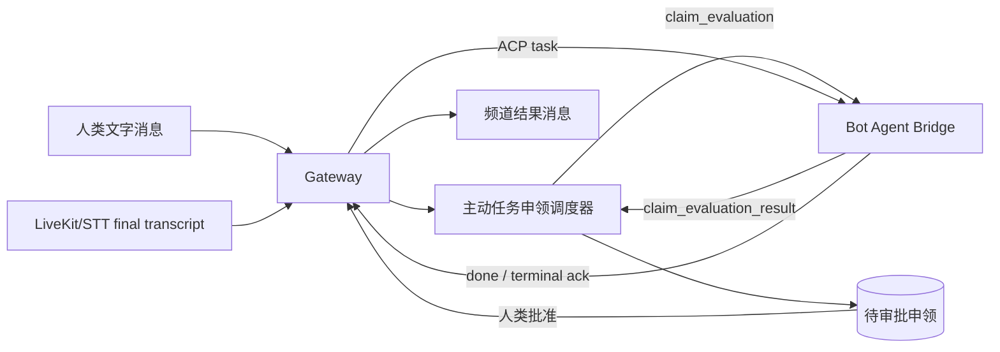

# Cheers 主动任务申领与实时语音协作

## 一句话总结

在多人文字或语音协作频道中，Bot 通过 Agent Bridge 持续接收频道活动，按频道配置的监听策略批量评估“是否有适合自己执行的任务”，生成待审批的任务申领；人类批准后，Gateway 通过 ACP/Agent Bridge 下发任务，Bot 执行并把结果回写到频道。

## 核心架构



职责边界：

- Bot 自己通过 Agent Bridge 接收评估请求和任务；系统负责调度、节流、持久化和权限控制。
- ACP 负责会话、任务和结果传输，不承担频道级监听策略或人工审批状态机。
- MCP/Resource 可作为 Bot 读取上下文的扩展，但申领主链路不依赖 MCP。
- 语音频道沿用同一频道事件时钟，final transcript 与文字消息进入统一调度输入。

## 已实现能力

### 1. 频道级监听策略

每个 `channel + bot` 独立配置：

- `mode`: `off`、`text`、`text_and_transcript`、`all_activity`
- `scope`: 给 Bot 的任务范围说明
- `debounce_seconds`: 新活动稳定后等待时间
- `min_interval_seconds`: 两次评估之间的最小间隔
- `max_evaluations_per_hour`: 小时预算
- `batch_size`: 单次评估最多活动条数
- `confidence_threshold`: 低于阈值的申领不进入审批

调度器具备 durable cursor、批量合并、在线状态检查、小时预算、租约恢复和失败回滚。

### 2. 申领与审批状态机

```text
reserved -> dispatched -> completed
                      \-> failed

claim request:
pending -> accepted -> executing -> completed
        \-> rejected
        \-> failed
```

内部触发消息使用 `is_secret=true`，不会出现在普通频道历史中；批准动作本身会广播 `task_claim_updated`，前端实时刷新审批卡片。

### 3. Agent Bridge / ACP 扩展

新增评估与结果事件：

- `claim_evaluation`
- `claim_evaluation_result`
- `task_claim_ack`

隔离评估阶段不开放 MCP 写操作，也不接受权限请求；只有人类批准后才进入正式任务派发。

### 4. 实时语音频道

- LiveKit 负责实时语音媒体平面。
- STT Worker 写入 final transcript segment。
- transcript 使用频道 `channel_seq`，因此可以和文字活动统一排序、恢复和调度。
- 语音任务申领与文字任务申领共用审批、ACP 下发和结果回写链路。

## 本次验证结果

### 自动化测试

- Gateway Rust：185 个测试全部通过
- Rust Connector：117 个测试全部通过
- Frontend：90 个测试及生产构建通过
- `cargo fmt --check`、`cargo check` 通过
- Docker Compose 配置校验通过
- Gateway 无缓存镜像构建并健康启动

### E2E 场景

1. 文字消息触发评估，Bot 返回 claim，人工批准后收到 ACP task，Bot 回写完成结果。
2. 语音 final transcript 触发评估，人工拒绝后没有任务下发。
3. 重复批准返回 `409`，没有重复执行。
4. 内部 `is_secret` 触发消息不会被公开消息列表返回。
5. 新建频道时传入 `initial_bot_ids`，Bot 自动拥有 PRIMARY session。
6. 未认证请求返回 `401`。
7. 非法监听频率配置返回 `400`。
8. Gateway、Postgres、Redis、RustFS、Frontend 全部健康；Gateway 日志无 ERROR、panic、FATAL。

## 验证期间修复的问题

- 修复新建频道初始 Bot 未创建 PRIMARY session 的契约缺口。
- 修复审批先改状态、后检查 session 导致申领卡死为 `accepted` 的问题。
- 修复普通消息历史接口泄露 `is_secret` 内部触发消息的问题。
- 修复 `docker-compose.yml.template` 的 Gateway build context 与 Dockerfile 路径不匹配问题。

对应提交：`78a8a5b6 fix: harden proactive claim execution`

## 当前限制与下一步

本次 E2E 已覆盖 transcript 写入后的完整任务申领闭环；尚未在真实麦克风、LiveKit SFU、STT Worker 的媒体链路上做现场音频测试。上线前建议补充：

- 一台独立 LiveKit 主机上的真实浏览器麦克风通话测试
- STT Worker 断线、重连、重复 webhook 测试
- 多 Bot 竞争同一任务时的优先级或抢占策略测试
- 前端审批卡片在多人同时操作时的冲突提示测试
- 2G 服务器上的资源监控、连接数和并发语音压测

## 部署建议

当前阶段继续使用 Docker Compose 即可。LiveKit、Gateway、Postgres、Redis、RustFS、STT Worker 可以按资源拆分到不同主机；当需要多副本 Gateway、自动扩缩容、跨节点故障转移时，再迁移到 Kubernetes。

## 相关代码

- `server/src/gateway/task_claim_scheduler.rs`
- `server/src/api/task_claims.rs`
- `server/src/api/channels.rs`
- `server/src/domain/messages.rs`
- `server/migrations/0057_proactive_task_claims.sql`
- `packages/cheers-acp-connector-rs/`
- `frontend/`

